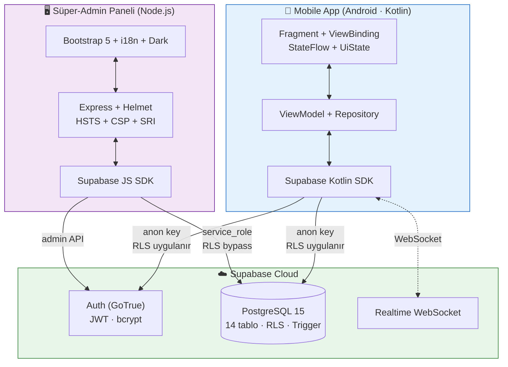
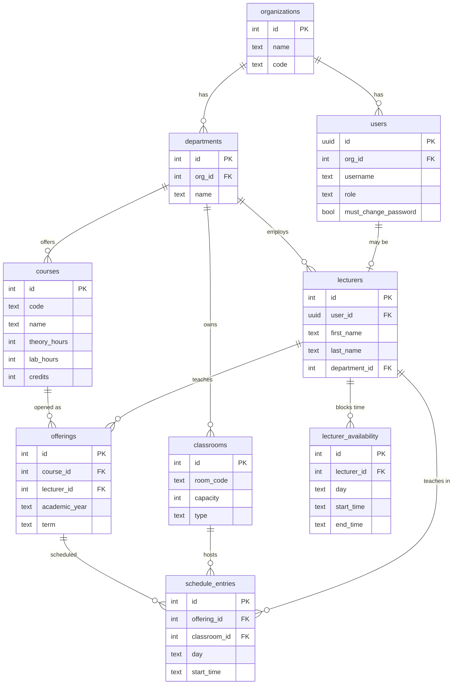
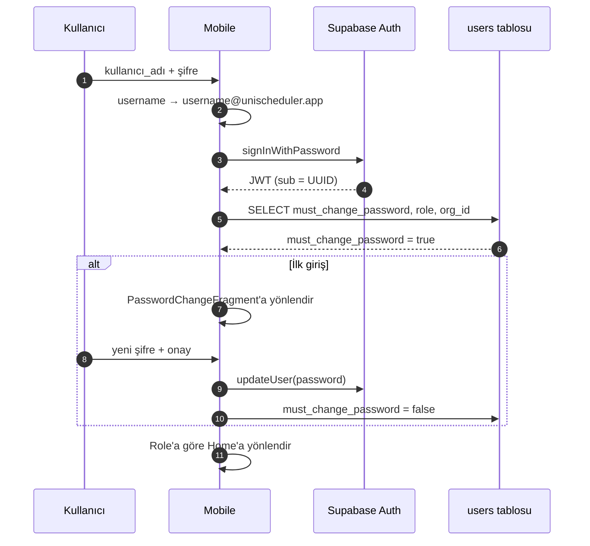
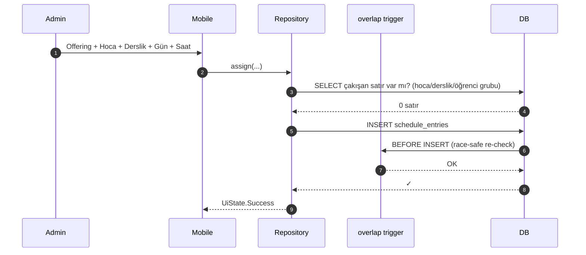
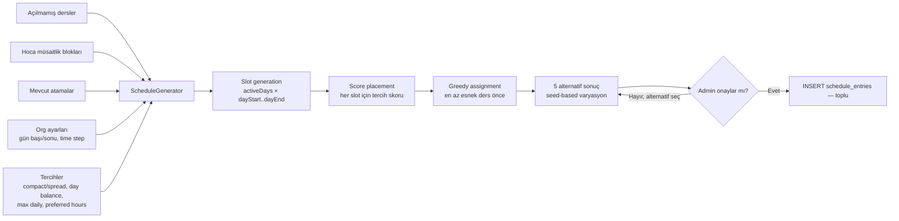
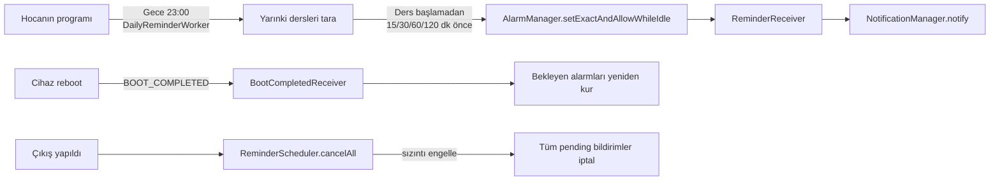

# UniScheduler

> **Çok-kiracılı üniversite ders programı yönetim sistemi.**
> Android mobil uygulama + süper-admin web paneli + Supabase backend.

<div align="center">

[](https://github.com/mehmetyasinuzun/UniScheduler/releases)
[](LICENSE)
[](#mobil-uygulama)
[](https://supabase.com)
[](.github/workflows/android-build.yml)

</div>

---

## İçindekiler

1. [Hızlı Bakış](#hızlı-bakış)
2. [Sistem Mimarisi](#sistem-mimarisi)
3. [Roller ve Yetkiler](#roller-ve-yetkiler)
4. [Veri Modeli](#veri-modeli)
5. [Kullanıcı Akışları](#kullanıcı-akışları)
6. [Mobil Uygulama](#mobil-uygulama)
7. [Süper-Admin Paneli](#süper-admin-paneli)
8. [Güvenlik](#güvenlik)
9. [Kurulum](#kurulum)
10. [Geliştirme ve CI/CD](#geliştirme-ve-cicd)
11. [Sıkça Karşılaşılan Sorunlar](#sıkça-karşılaşılan-sorunlar)

---

## Hızlı Bakış

| Bileşen | Teknoloji | Açıklama |
|---|---|---|
| **Mobil** | Kotlin · MVVM · ViewBinding · Coroutines · Material 3 | Admin + Hoca rolleri, 8 ana ekran, TR + EN, light/dark tema |
| **Web Panel** | Node.js · Express · Vanilla JS · Bootstrap 5.3 | Süper-admin için 8 sayfa: org/admin yönetimi + CTI |
| **Backend** | Supabase (PostgreSQL 15 + GoTrue Auth + Realtime) | 14 tablo, RLS politikaları, audit trigger, race-condition korumalı schedule |
| **CI/CD** | GitHub Actions + Dependabot + dbmate | Push'ta otomatik build/test, tag'de release, haftalık dep tarama |

**Özet özellikler:** çoklu-kiracı izolasyon · otomatik program üretici · Excel/iCal/PDF/JSON çıkışı · CTI tehdit izleme (GeoIP + zaman serisi + webhook alert) · çevrimdışı banner + crash buffer · 396 string TR/EN parite.

---

## Sistem Mimarisi



**Çok kiracılı yalıtım:** Her veri satırında `org_id` kolonu var. PostgreSQL Row-Level Security (RLS) politikaları kullanıcının JWT'sinden çıkardığı `org_id`'ye göre erişimi sınırlar. Mobil uygulama `anon_key` ile çalışır (RLS uygulanır), web paneli `service_role` ile çalışır (RLS bypass — yalnız süper-admin için).

---

## Roller ve Yetkiler

| Rol | Nereye Girer | Ne Yapabilir |
|---|---|---|
| **Süper-Admin** | Web paneli | Tüm organizasyonları yönetir, admin hesabı oluşturur/şifre sıfırlar, sistemin hata loglarını ve giriş denemelerini (CTI) izler |
| **Admin** | Mobil app (5 sekme) | Kendi kurumunun hoca/ders/derslik kayıtlarını yönetir, ders atar, otomatik program üretir, Excel/PDF/JSON çıkartır |
| **Hoca** | Mobil app (3 sekme) | Kendi haftalık programını görür, müsait olmadığı saatleri işaretler, PDF/iCal indirir |

---

## Veri Modeli

**14 tablo · RLS her tabloda · soft-delete + audit log + race-condition trigger.** Tam ER diyagramı için [docs/diagrams/er-diagram.md](docs/diagrams/er-diagram.md) — burada özet:



**Diğer 4 tablo** (gözlemlenebilirlik): `audit_log`, `login_attempts`, `client_error_logs`, `super_admins`.

---

## Kullanıcı Akışları

### Login + Şifre Değiştirme



### Atama + Çakışma Kontrolü



Uygulama-katmanı çakışma kontrolü + DB-katmanı trigger = iki admin aynı milisaniyede atama yapsa bile birinin işlemi reddedilir. TOCTOU kapatıldı.

### Otomatik Program Üretici



---

## Mobil Uygulama

### Admin Akışı — 5 Bottom Nav Sekmesi

| Sekme | İçerik |
|---|---|
| **Home** | Atanmamış hoca/ders/derslik panelleri (real-time) + kurum istatistikleri |
| **Calendar** | Tüm kurum programı, filtreli (bölüm + sınıf + hoca + derslik), PDF çıkışı |
| **Data** | Hoca/ders/derslik akordeon yönetimi, Excel import/export, Settings butonu |
| **Classrooms** | Sınıf listesi, ekleme/düzenleme, derslik bazlı çakışma görünümü |
| **Assign** | Manuel atama formu + otomatik program üretici + çakışma diyalogu |

> Settings sekmesi Data sekmesindeki "Bölümleri Yönet" butonundan açılır — bölüm yönetimi, org ayarları (zaman dilimi/mesai), JSON yedek/geri yükle, dil/tema, çıkış.

### Hoca Akışı — 3 Bottom Nav Sekmesi

| Sekme | İçerik |
|---|---|
| **Home** | Hoş geldin mesajı, bölüm bilgisi, bu hafta atanan ders sayısı, PDF/iCal indirme, bildirim tercihleri, dil/tema, çıkış |
| **Availability** | Pzt-Cuma × saat ızgarası — "şu saatte müsait değilim" blok ekleme |
| **Schedule** | Kendi haftalık programı (admin'in atadığı dersler), "şimdi" çizgisi, kart detay diyalogu |

### Veri Alışverişi

- **Excel `.xlsx`** — Hoca, ders, derslik için içe/dışa aktarım. Önizleme diyalogu hatalı satırları kırmızı işaretler. Excel parser projeye özel yazılmış (`MiniXlsxReader` / `Writer` ~400 satır, Apache POI bağımlılığı yok)
- **PDF (A4 yatay)** — Calendar'dan filtreli program, otomatik dosya adı (`program-bilgisayar-2sinif-2026-05-10.pdf`), paylaş butonu
- **iCal `.ics`** — RFC 5545 uyumlu, 14 hafta haftalık tekrar (`RRULE:FREQ=WEEKLY;COUNT=14`), telefon takvimine 1 tıkla aktarım
- **JSON yedek/geri yükle** — Tüm org datasını tek dosyaya, geri yükleme önizleme diyalogu ile

### Bildirim Sistemi



---

## Süper-Admin Paneli

8 sayfa — sticky global org seçici, dark mode, TR/EN.

| Sayfa | İçerik |
|---|---|
| **Organizasyonlar** | Org ekle/sil, kod normalize (Türkçe karakter ASCII'ye, uppercase) |
| **Admin Kullanıcılar** | Her org için admin oluştur, geçici şifre + toplu sıfırlama |
| **Dashboard** | Org bazında bölüm/hoca/ders/derslik/atama özeti, akordeon yönetimi |
| **Açılan Dersler** | Term-bazlı ders şubeleri |
| **Haftalık Çizelge** | Tüm kurum programı görsel ızgara, filtreler, manuel ekle, otomatik oluştur |
| **Müsaitlik** | Hoca bazında meşgul blokları, dersi olan saatler ayrı renkte |
| **Hata Logları** | Mobile + panel hata raporları, kaynak filtresi, stack trace modal |
| **Giriş Denemeleri (CTI)** | Risk skorlu giriş hareketleri |

### CTI Sayfası — Tehdit İzleme Detay

- **Risk skorlama** — başarısız sayısı, cihaz başına farklı kullanıcı sayısı, emülatör imzası
- **Saatlik dağılım** — `Chart.js` bar grafiği (gece 03:00 zirvesi = bot pattern)
- **Günlük trend (son 30 gün)** — `Chart.js` line chart, başarı/başarısız ayrı renkte
- **GeoIP** — `ip-api.com` batch + localStorage 7 gün cache, her IP yanında ülke bayrağı 🇹🇷
- **Saldırıya uğrayan kullanıcılar / Şüpheli cihazlar / IP yoğunluğu** — 3 sütun
- **CSV export** — RFC 4180 + UTF-8 BOM (Excel TR uyumlu)
- **Manuel hesap dondurma** — Kullanıcıyı `is_active=false` yapar (RLS sonra tüm istekleri reddeder)
- **Alerting webhook (opsiyonel)** — `ALERT_WEBHOOK_URL` env varsa Slack/Discord'a otomatik bildirim (risk eşiği aşılınca, cooldown'lu)
- **Otomatik retention** — 90 günden eski kayıtlar her gece silinir + manuel temizlik butonu

---

## Güvenlik

| Katman | Önlem |
|---|---|
| **Auth** | Supabase GoTrue (JWT) · Otomatik kullanıcı adı + 6 karakterlik geçici şifre · `must_change_password` ilk girişte zorunlu değişim |
| **RLS** | Her tabloda `org_id = current_org_id()` policy · admin/lecturer ayrımı `is_admin()` / `is_lecturer()` SECURITY DEFINER fonksiyonlarıyla |
| **Şifre Sıfırlama** | `admin_reset_lecturer_password` SECURITY DEFINER RPC — admin'in kendi org'undaki hocaya pgcrypto bcrypt hash ile yeni şifre yazar; mobil app'e `service_role` gerekmez |
| **Web Paneli** | Helmet (CSP + HSTS + frameguard:deny) · CORS allowlist · rate-limit · CDN SRI hash'leri (Bootstrap, Bootstrap Icons, Chart.js) · default şifre prod'da reddedilir |
| **Mobil** | `local.properties` git'e gitmez · `EncryptedSharedPreferences` (AES256-GCM) · `allowBackup=false` · `usesCleartextTraffic=false` · network security config |
| **Audit** | Her INSERT/UPDATE/DELETE `audit_log` tablosuna trigger ile yazılır (kim, ne zaman, eski → yeni JSON) |
| **CTI** | Her giriş denemesi `login_attempts` tablosuna cihaz/IP/UA/aşama bilgisiyle yazılır · GeoIP enrichment · risk skorlaması |
| **Crash Telemetri** | Yakalanmamış UI thread crash'leri `cacheDir/crashes/` altına diske yazılır → sonraki login'de DB'ye gönderilir |
| **Race-Condition Korumalı Schedule** | `prevent_schedule_overlap` trigger transaction içinde son durumu okur, iki admin aynı milisaniyede atama yapsa bile ikincisi reddedilir |

---

## Kurulum

### Ön Koşullar

| Bileşen | Sürüm |
|---|---|
| Node.js | ≥ 18 |
| JDK | 17 |
| Android Studio | ≥ Hedgehog |
| Android SDK | API 34 |
| Supabase hesabı | ücretsiz tier yeterli |

### 1. Supabase

1. https://app.supabase.com → **New project** (region: kullanıcılarınıza en yakın)
2. **Authentication → Providers → Email**: provider AÇIK, **Confirm email KAPALI** (mecburi), Secure email change KAPALI
3. **Authentication → Settings**: Enable Signups AÇIK
4. **SQL Editor**: [`supabase/schema.sql`](supabase/schema.sql)'in tamamını yapıştır → **Run**
5. **Settings → API**: `Project URL`, `anon` public key, `service_role` secret key kaydet

> ⚠ Şema script'i `DROP IF EXISTS` ile başlar — sadece yeni projede veya tam reset için çalıştırın.
> Production güncellemeleri için [dbmate migration](supabase/README.md#2-production-deploy--dbmate-ile-versiyonlu-migration) kullanın.

### 2. Mobil Uygulama

```bash
cd UniScheduler
cp local.properties.example local.properties
# local.properties içinde SUPABASE_URL ve SUPABASE_ANON_KEY doldur
./gradlew assembleDebug
```

APK çıktısı: `app/build/outputs/apk/debug/app-debug.apk`.

**Release imzalı APK için:**
```powershell
keytool -genkey -v -keystore unischeduler-release.jks `
        -keyalg RSA -keysize 2048 -validity 10000 -alias unischeduler
```
local.properties'e ekle:
```
KEYSTORE_FILE=C:\\path\\to\\unischeduler-release.jks
KEYSTORE_PASSWORD=...
KEY_ALIAS=unischeduler
KEY_PASSWORD=...
```
Sonra: `./gradlew assembleRelease`

> Keystore'u **kaybetmeyin**. Kaybedersen Play Store'a aynı uygulamayı bir daha güncelleyemezsin.

### 3. Süper-Admin Web Paneli

```bash
cd super-admin-paneli
cp .env.example .env
# .env içinde SUPABASE_URL, SUPABASE_SERVICE_KEY, ADMIN_PASSWORD doldur
npm install
npm start
```

Tarayıcı: `http://localhost:3000`.

İlk organizasyonu paneldeki **Organizasyonlar** sayfasından oluştur, ardından **Adminler** sayfasından bu org'a admin ekle. Üretilen kullanıcı adı/şifreyi not al.

### 4. İlk Kurulum Sonrası Doğrulama

1. Web panel: `http://localhost:3000` → giriş → org listesi yüklensin
2. Yeni org oluştur → admin ekle → kullanıcı adı + şifre kopyala
3. Mobil APK kur → bu admin'le giriş → Settings → Bölüm ekle → 5 saniye içinde liste güncellensin
4. Data → Hoca ekle → kullanıcı adı + şifre dialogu açılsın → kopyala
5. Üretilen şifreyle hocayı login et → Home'da hoş geldin mesajı + ders sayısı görünsün

---

## Geliştirme ve CI/CD

### Otomatik Build + Test

Her `git push`'ta GitHub Actions çalışır:

| Workflow | Tetik | Yaptıkları |
|---|---|---|
| `android-build.yml` | push/PR | Lint + Robolectric test + debug APK (artifact, 7 gün) |
| `panel-check.yml` | push/PR (panel dosyaları) | Node syntax + i18n parite + npm audit |
| `release.yml` | `v*.*.*` tag | İmzalı release APK + otomatik GitHub Release notes |

### Dependabot

Pazartesi 06:00 (İstanbul) Gradle + npm + GitHub Actions taraması; AndroidX/Kotlin/Supabase grup PR'ları.

### Yeni Şema Değişikliği

```bash
cd supabase
dbmate new add_request_id_to_audit
# migrations/20260601120000_add_request_id_to_audit.sql düzenle
dbmate up   # local DB'ye uygula
git push    # CI çalışır → tag at → release.yml otomatik APK üretir
```

Detay: [supabase/README.md](supabase/README.md).

### Sürüm Yayınlama

```bash
# 1. Versiyonu artır (app/build.gradle.kts: versionCode + versionName)
# 2. Commit + tag
git tag v1.2.8
git push origin v1.2.8
# 3. GitHub Actions release.yml tetiklenir → APK + Release notes otomatik
```

---

## Sıkça Karşılaşılan Sorunlar

### "Hocaya ait kayıt bulunamadı" — login sonrası hata
Lecturer profili eksik veya tutarsız. Supabase SQL Editor'da:
```sql
SELECT u.id, u.username, u.role, u.is_active, u.deleted_at,
       l.id AS lecturer_id, l.deleted_at AS lec_deleted
FROM public.users u
LEFT JOIN public.lecturers l ON l.user_id = u.id
WHERE u.username = '<KULLANICI_ADI>';
```
- `lecturer_id` NULL → admin panelinden hocayı yeniden ekle
- `lec_deleted` doldu → `UPDATE public.lecturers SET deleted_at=NULL WHERE id=...`

### "User already registered" — hoca eklerken
Önceki kurulumdan `auth.users` tablosunda aynı email kalmış. `schema.sql`'in en üstündeki cleanup bloğu bunu siler — ama tüm veriyi de siler.

### Excel import "tüm satırlar hatalı" gösteriyor
Kolon başlıkları yanlış. Türkçe karakter farkı önemsiz ("Ünvan" / "Unvan" / "title" hepsi çalışır). Unicode tire `–` yerine ASCII `-` kullanın.

### Android 16 (SDK 36) — eski APK'da TextView NPE
v1.2.0 öncesinde TextView/MaterialSwitch widget'ları `android:text` olmadan Android 16'da `StaticLayout` constructor NPE atıyordu. v1.2.6 bunu kapsayan default değerlerle çözdü.

### "ADMIN_PASSWORD too short" — panel başlamıyor
Production'da `.env` içinde `ADMIN_PASSWORD` 12 karakterden kısa veya tipik bir default ("admin", "password"). **16+ karakter random** koy.

---

## Lisans

Proprietary — bkz. [LICENSE](LICENSE).

Üçüncü taraf:
- Supabase, AndroidX, Material, Kotlin — Apache 2.0 / MIT
- Bootstrap 5.3, Bootstrap Icons, Chart.js — MIT (CDN üzerinden SRI hash ile)

---

## Hızlı Referans

```
UniScheduler/
├── app/                  ← Android mobile app (Kotlin · MVVM)
├── super-admin-paneli/   ← Web panel (Node.js · Express)
├── supabase/             ← schema.sql + dbmate migrations + runbook
├── docs/diagrams/        ← ER diagram + akış şemaları (Mermaid)
├── .github/              ← CI/CD workflows + Dependabot + templates
└── README.md             ← bu dosya
```

📂 **Detaylı dokümanlar:**
- [Supabase setup + dbmate runbook](supabase/README.md)
- [Süper-admin panel detayı](super-admin-paneli/README.md)
- [ER diagram + akış şemaları](docs/diagrams/er-diagram.md)
