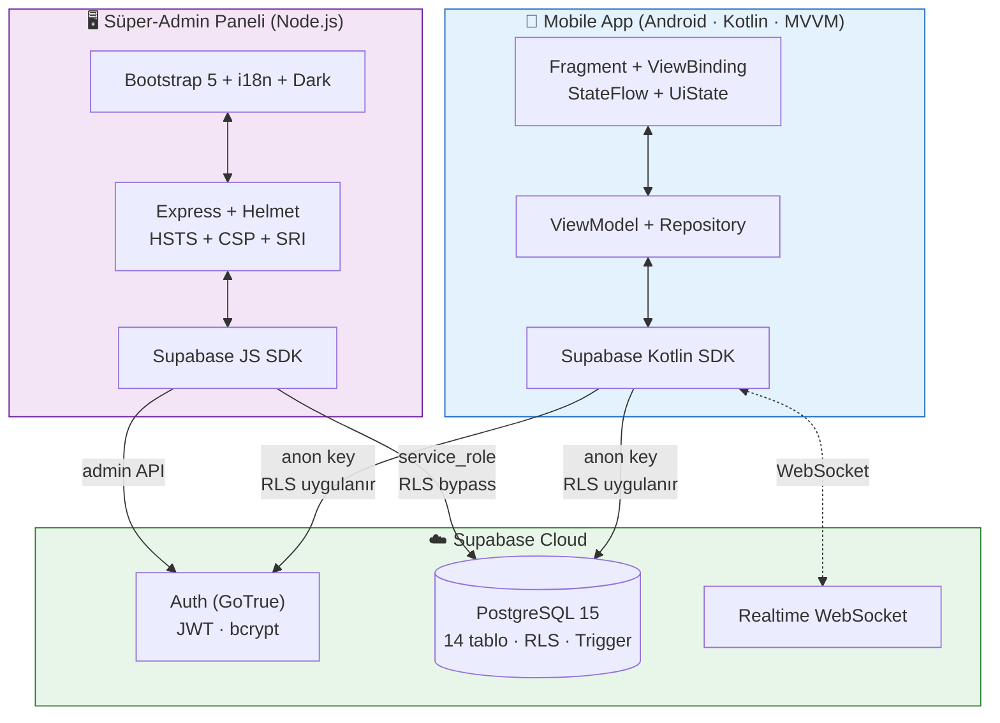
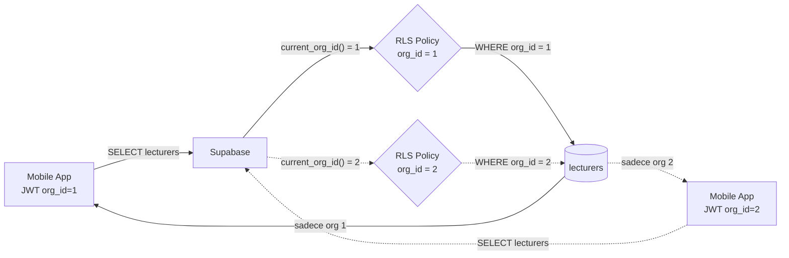
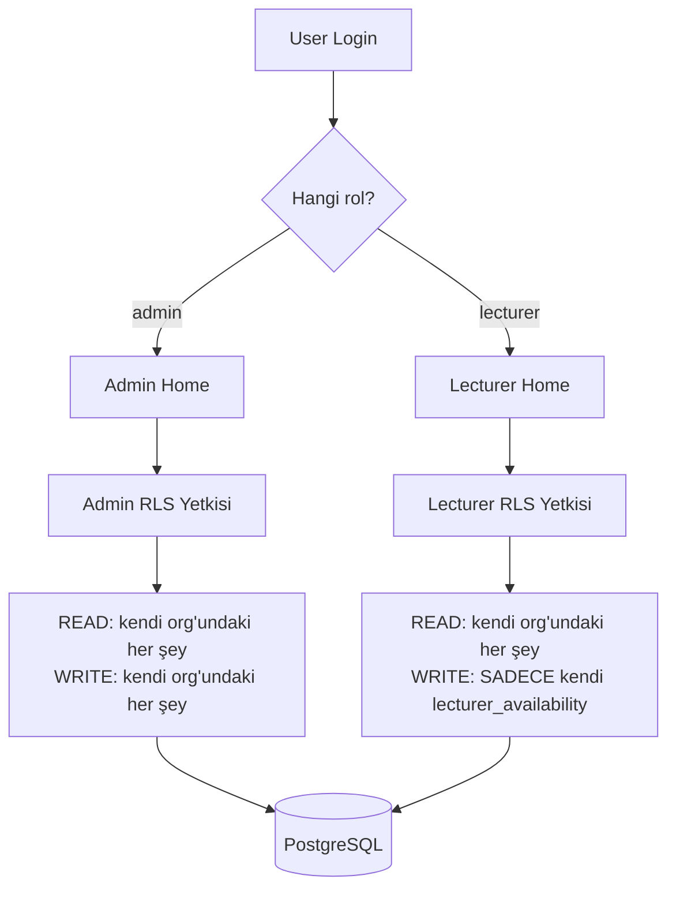
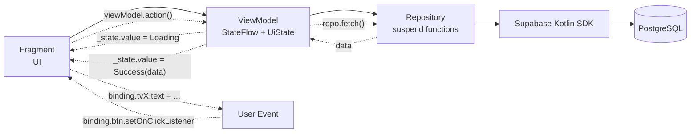
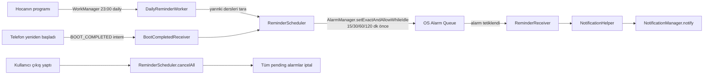
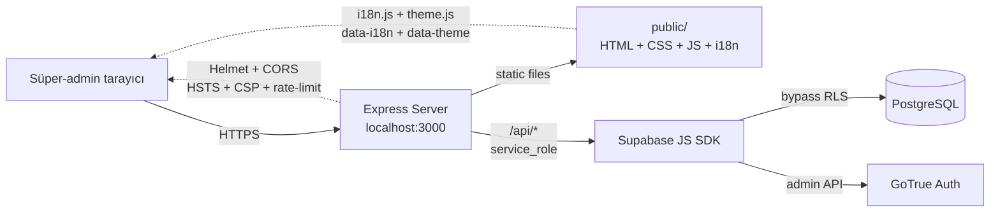
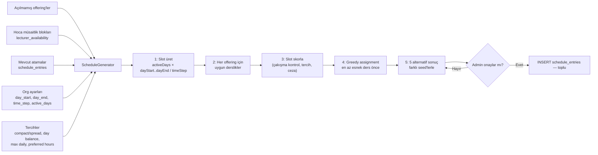
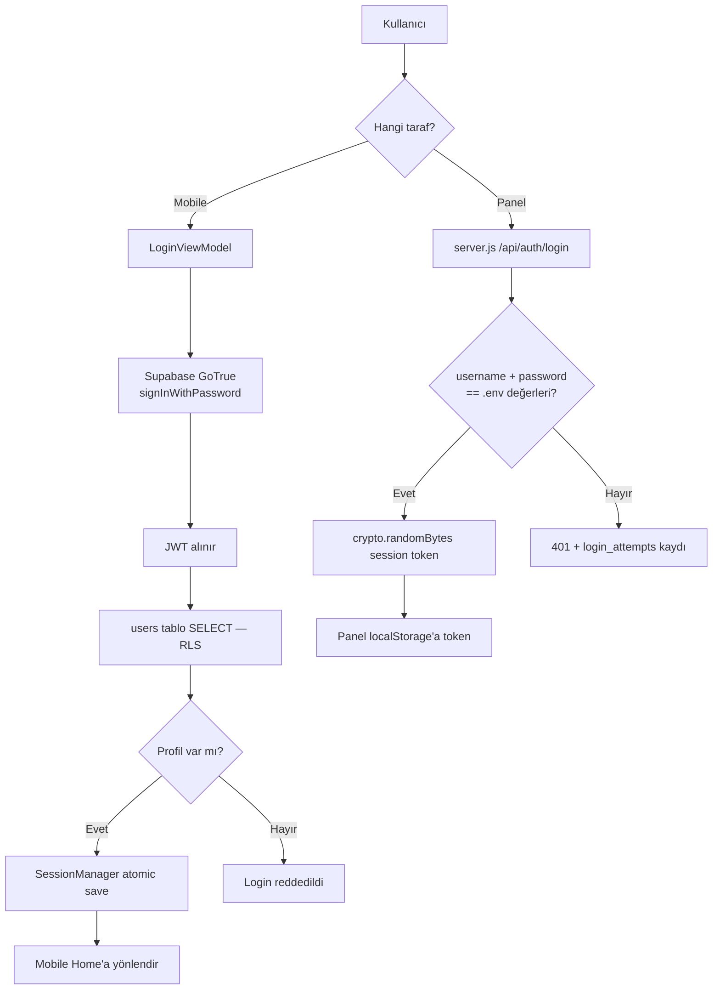

# UniScheduler — Proje El Kitabı

> Bu doküman projenin **tüm yapısını** baştan sona açıklar. Her dosya, her tablo, her algoritma, her güvenlik kararı.
>
> **Format seçimi:** Markdown. Çünkü kod blokları syntax highlight ile, Mermaid diyagramlar otomatik render ile, tablolar net görünür. GitHub'da `docs/PROJE-EL-KITABI.md`'ı açtığında tam interaktif bir el kitabı olur.
>
> Sonunda pandoc ile Word'e de çevirebilirsin: `pandoc PROJE-EL-KITABI.md -o PROJE-EL-KITABI.docx`

---

## İçindekiler

1. [Genel Bakış](#1-genel-bakış)
2. [Sistem Mimarisi](#2-sistem-mimarisi)
3. [Veritabanı (Supabase / PostgreSQL)](#3-veritabanı-supabase--postgresql)
4. [Mobile App (Android / Kotlin)](#4-mobile-app-android--kotlin)
5. [Süper-Admin Paneli (Node.js)](#5-süper-admin-paneli-nodejs)
6. [Otomatik Program Üretici (ScheduleGenerator)](#6-otomatik-program-üretici-schedulegenerator)
7. [Güvenlik Katmanları](#7-güvenlik-katmanları)
8. [DevOps & CI/CD](#8-devops--cicd)
9. [Test Altyapısı](#9-test-altyapısı)
10. [Sürüm Geçmişi ve Önemli Düzeltmeler](#10-sürüm-geçmişi-ve-önemli-düzeltmeler)
11. [Sıkça Sorulan Sorular (Hocaya Defans)](#11-sıkça-sorulan-sorular-hocaya-defans)
12. [Demo Senaryosu (10 Dakika)](#12-demo-senaryosu-10-dakika)

---

## 1. Genel Bakış

### 1.1 Proje Nedir?

UniScheduler, **üniversitelerin ders programlarını yöneten çok-kiracılı (multi-tenant) bir sistem**. Tek bir backend üzerinde birden fazla kurum (organizasyon) tamamen yalıtılmış olarak çalışır.

### 1.2 Üç Bileşen

| Bileşen | Teknoloji | Sorumluluk |
|---|---|---|
| **Mobile App** | Android · Kotlin · MVVM · Material 3 | Admin + Hoca rolleri için günlük kullanım |
| **Süper-Admin Paneli** | Node.js · Express · Bootstrap 5 · Vanilla JS | Sistem sahibinin organizasyon/admin yönetimi + CTI izleme |
| **Backend** | Supabase (PostgreSQL 15 + GoTrue + Realtime) | Veri, kimlik doğrulama, RLS izolasyonu, real-time |

### 1.3 Üç Rol

| Rol | Nereye Girer | Yetkiler |
|---|---|---|
| **Süper-Admin** | Web paneli | Tüm organizasyonları yönetir, admin hesabı oluşturur, şifre sıfırlar, CTI/hata loglarını izler |
| **Admin** | Mobil app — 5 alt sekme | Kendi kurumunun hoca/ders/derslik kayıtlarını yönetir, atama yapar, otomatik program üretir, Excel/PDF/JSON çıkartır |
| **Hoca** | Mobil app — 3 alt sekme | Kendi haftalık programını görür, müsait olmadığı saatleri işaretler, programı PDF/iCal indirir |

### 1.4 Proje Boyutu

| Metrik | Değer |
|---|---|
| Kotlin dosyaları | 80 |
| Layout XML | 27 |
| String resource (TR=EN parite) | 402 |
| Material vector ikon | 28 |
| `supabase/schema.sql` | 847 satır (14 tablo, 31 RLS policy, 32 trigger) |
| `server.js` (panel) | 1754 satır |
| `public/index.html` | 698 satır |
| `public/js/app.js` | 877 satır |
| Release APK boyutu | 4.4 MB |
| Robolectric unit test | 16 dosya |

### 1.5 Faz 1'den Faz 2'ye Geçiş

| Faz 1 (Local) | Faz 2 (Centralized) |
|---|---|
| SQLite tek cihazda | Supabase PostgreSQL, çoklu cihaz |
| Manuel kullanıcı/şifre | Otomatik üretilen kullanıcı adı + 6 karakter şifre |
| Login yok | Rol bazlı login (admin/hoca) |
| Calendar view-only | Hoca kendi programını görür |
| Derslik kavramı yok | Derslikler + atama + çakışma engeli |
| Admin her şeyi görür | Admin atanmamış hocalar/dersler/derslikleri görür |

---

## 2. Sistem Mimarisi

### 2.1 Üst Düzey Diagram



### 2.2 Çok-Kiracılı (Multi-Tenant) Tasarım

Her veri satırında `org_id` kolonu var. RLS politikaları satır-satır filtreler:



**Neden bu yaklaşım?** Faz 2 ödevi tek tenant istiyordu ama tasarım sırasında çoklu kurumu desteklemek için `org_id` her tabloya eklendi. Mobile bug'ı yapsa bile RLS satırları filtreler — başka kurumun verisi sızmaz.

### 2.3 İzin Modeli



Admin'in her şeyi yazabilmesi RLS'de `is_admin() AND org_id = current_org_id()` kontrolü ile. Hoca atama yapamaz — sadece müsaitlik bloğu ekler.

---

## 3. Veritabanı (Supabase / PostgreSQL)

### 3.1 ER Diagram (Tam Hali)

```mermaid
erDiagram
    organizations ||--|| org_settings : "1:1"
    organizations ||--o{ users : "has"
    organizations ||--o{ departments : "has"
    organizations ||--o{ lecturers : "has"
    organizations ||--o{ courses : "has"
    organizations ||--o{ classrooms : "has"
    organizations ||--o{ offerings : "has"
    organizations ||--o{ schedule_entries : "has"
    organizations ||--o{ lecturer_availability : "has"

    users ||--o| lecturers : "may be"
    departments ||--o{ lecturers : "employs"
    departments ||--o{ courses : "offers"
    departments ||--o{ classrooms : "owns"

    courses ||--o{ offerings : "opened as"
    lecturers ||--o{ offerings : "teaches"
    lecturers ||--o{ schedule_entries : "scheduled"
    lecturers ||--o{ lecturer_availability : "blocks time"

    offerings ||--o{ schedule_entries : "appears in"
    classrooms ||--o{ schedule_entries : "hosts"

    organizations {
        int id PK
        text name
        text code "UNIQUE A-Z0-9_-"
    }
    org_settings {
        int org_id PK_FK
        int time_step_minutes "5-60"
        text day_start "HH:MM"
        text day_end "HH:MM"
    }
    users {
        uuid id PK "auth.users FK"
        int org_id FK
        text username "UNIQUE"
        text role "admin or lecturer"
        bool must_change_password
        bool is_active
    }
    departments {
        int id PK
        int org_id FK
        text name
    }
    lecturers {
        int id PK
        uuid user_id FK "UNIQUE"
        text title
        text first_name
        text last_name
        int department_id FK
    }
    courses {
        int id PK
        text code "UNIQUE per org"
        text name
        int theory_hours
        int lab_hours
        int credits
        int department_id FK
    }
    classrooms {
        int id PK
        text room_code
        int capacity
        text type "theory or lab"
        int department_id FK
    }
    offerings {
        int id PK
        int course_id FK
        int lecturer_id FK "nullable"
        text academic_year
        text term "Fall Spring Summer"
        int class_year "1-4"
        text section
    }
    schedule_entries {
        int id PK
        int offering_id FK
        int lecturer_id FK
        int classroom_id FK
        text day
        text start_time
        text end_time
    }
    lecturer_availability {
        int id PK
        int lecturer_id FK
        text day
        text start_time
        text end_time
    }
```

### 3.2 14 Tablonun Tek Tek Anlatımı

#### Tablo 1: `organizations`

```sql
CREATE TABLE organizations (
    id          SERIAL PRIMARY KEY,
    name        TEXT NOT NULL CHECK (length(trim(name)) > 0),
    code        TEXT NOT NULL UNIQUE CHECK (code ~ '^[A-Z0-9_-]{2,20}$'),
    created_at  TIMESTAMPTZ NOT NULL DEFAULT NOW(),
    updated_at  TIMESTAMPTZ NOT NULL DEFAULT NOW()
);
```

**Amaç:** Multi-tenant kökü. Her organizasyon bir üniversiteye/kuruma karşılık gelir.

**Önemli:** `code` regex'i `^[A-Z0-9_-]{2,20}$` — büyük harf, rakam, alt çizgi, tire. Türkçe karakter girilirse panel'in `normalizeOrgCode()` fonksiyonu ASCII'ye çevirir (ş→s, ç→c, ü→u) ve uppercase yapar.

**Cascade:** Bir organizasyon silinince `ON DELETE CASCADE` ile altındaki **tüm** veri (users, departments, lecturers, courses, classrooms, offerings, schedule_entries, lecturer_availability) silinir. Bu agresif ama bilinçli — multi-tenant'ta org silmek nadir bir admin işidir.

#### Tablo 2: `org_settings`

```sql
CREATE TABLE org_settings (
    org_id            INT PRIMARY KEY REFERENCES organizations(id) ON DELETE CASCADE,
    time_step_minutes INT  NOT NULL DEFAULT 10 CHECK (time_step_minutes BETWEEN 5 AND 60),
    active_days       TEXT[] NOT NULL DEFAULT ARRAY['Monday','Tuesday','Wednesday','Thursday','Friday'],
    day_start         TEXT NOT NULL DEFAULT '08:00' CHECK (day_start ~ '^[0-2][0-9]:[0-5][0-9]$'),
    day_end           TEXT NOT NULL DEFAULT '18:00' CHECK (day_end ~ '^[0-2][0-9]:[0-5][0-9]$'),
    updated_at        TIMESTAMPTZ NOT NULL DEFAULT NOW(),
    CHECK (day_start < day_end)
);
```

**Amaç:** Her organizasyona özel program ayarları:
- `time_step_minutes`: ders saat aralıkları (10 dakika, 15, 30 vb. — admin seçer)
- `active_days`: çalışma günleri (varsayılan Pzt-Cum, Cumartesi eklenebilir)
- `day_start` / `day_end`: günlük çalışma saatleri

Otomatik program üretici bu ayarlara göre slot'ları üretir.

**Çift CHECK:** Hem regex format kontrolü hem mantıksal `day_start < day_end`.

#### Tablo 3: `users`

```sql
CREATE TABLE users (
    id                   UUID PRIMARY KEY REFERENCES auth.users(id) ON DELETE CASCADE,
    org_id               INT  NOT NULL REFERENCES organizations(id) ON DELETE CASCADE,
    username             TEXT NOT NULL UNIQUE
                              CHECK (username ~ '^[a-z0-9_]{3,40}$'),
    role                 TEXT NOT NULL CHECK (role IN ('admin', 'lecturer')),
    must_change_password BOOLEAN NOT NULL DEFAULT FALSE,
    is_active            BOOLEAN NOT NULL DEFAULT TRUE,
    deleted_at           TIMESTAMPTZ,
    last_login_at        TIMESTAMPTZ,
    created_at           TIMESTAMPTZ NOT NULL DEFAULT NOW(),
    updated_at           TIMESTAMPTZ NOT NULL DEFAULT NOW()
);
```

**Amaç:** Mobil app'in auth profili. `auth.users` (Supabase GoTrue) ile 1:1 ilişki.

**Username kuralı:** Sadece küçük harf, rakam, alt çizgi. Türkçe karakter normalize ediliyor (`halit_bakir` formatı).

**Rol:** Sadece `admin` veya `lecturer`. Süper-admin web panelinde, `super_admins` tablosunda — bu rol mobile'da yok.

**`must_change_password`:** İlk girişte hoca/admin geçici şifre değiştirmek zorunda. Faz 2 §3.2'nin karşılığı.

**Soft delete:** `deleted_at` ile silinmiş kullanıcılar fiziksel olarak DB'de kalır ama RLS politikaları görmezden gelir.

#### Tablo 4: `departments`

```sql
CREATE TABLE departments (
    id          SERIAL PRIMARY KEY,
    org_id      INT NOT NULL REFERENCES organizations(id) ON DELETE CASCADE,
    name        TEXT NOT NULL CHECK (length(trim(name)) > 0),
    deleted_at  TIMESTAMPTZ,
    created_at  TIMESTAMPTZ NOT NULL DEFAULT NOW(),
    updated_at  TIMESTAMPTZ NOT NULL DEFAULT NOW(),
    UNIQUE (org_id, name)
);
```

**Amaç:** Kurumun bölümleri (Bilgisayar Mühendisliği, Elektrik-Elektronik, vb.).

**`UNIQUE (org_id, name)`:** Aynı org'da iki bölüm aynı adı taşıyamaz, ama farklı org'larda olabilir.

#### Tablo 5: `lecturers`

```sql
CREATE TABLE lecturers (
    id            SERIAL PRIMARY KEY,
    org_id        INT  NOT NULL REFERENCES organizations(id) ON DELETE CASCADE,
    user_id       UUID NOT NULL REFERENCES users(id) ON DELETE CASCADE,
    title         TEXT NOT NULL DEFAULT '',
    first_name    TEXT NOT NULL CHECK (length(trim(first_name)) > 0),
    last_name     TEXT NOT NULL CHECK (length(trim(last_name)) > 0),
    email         CITEXT,
    phone         TEXT,
    department_id INT REFERENCES departments(id) ON DELETE SET NULL,
    deleted_at    TIMESTAMPTZ,
    UNIQUE (user_id),
    CHECK (email IS NULL OR email ~ '^[^@\s]+@[^@\s]+\.[^@\s]+$')
);
```

**Amaç:** Akademisyen profili. `users` ile 1:1 (`UNIQUE user_id`).

**Title:** "Prof. Dr.", "Doç. Dr.", "Dr. Öğr. Üyesi", vb. — kısaltma değil, tam yazılır.

**`department_id ON DELETE SET NULL`:** Bölüm silinirse hocayı kaybetmeyiz, sadece bölüm bağı kalkar. (Cascade değil — bilinçli karar.)

**`CITEXT email`:** Case-insensitive — `Test@MAIL.com` ve `test@mail.com` aynı satır sayılır.

#### Tablo 6: `courses`

```sql
CREATE TABLE courses (
    id            SERIAL PRIMARY KEY,
    org_id        INT  NOT NULL REFERENCES organizations(id) ON DELETE CASCADE,
    code          TEXT NOT NULL CHECK (length(trim(code)) > 0),
    name          TEXT NOT NULL CHECK (length(trim(name)) > 0),
    theory_hours  INT  NOT NULL DEFAULT 0 CHECK (theory_hours >= 0 AND theory_hours <= 20),
    lab_hours     INT  NOT NULL DEFAULT 0 CHECK (lab_hours    >= 0 AND lab_hours    <= 20),
    credits       INT  NOT NULL DEFAULT 0 CHECK (credits      >= 0 AND credits      <= 30),
    department_id INT REFERENCES departments(id) ON DELETE SET NULL,
    UNIQUE (org_id, code)
);
```

**Amaç:** Ders kataloğu. `code` ders kodu (örn. CNG342), `theory_hours` haftalık teori saati, `lab_hours` lab saati, `credits` AKTS.

**CHECK kuralları:** Saat değerleri 0-20 arası (mantıksal sınır), kredi 0-30. UNIQUE constraint: aynı org'da aynı kod tekrarlanamaz.

#### Tablo 7: `classrooms`

```sql
CREATE TABLE classrooms (
    id            SERIAL PRIMARY KEY,
    org_id        INT  NOT NULL REFERENCES organizations(id) ON DELETE CASCADE,
    room_code     TEXT NOT NULL CHECK (length(trim(room_code)) > 0),
    capacity      INT  NOT NULL DEFAULT 30 CHECK (capacity > 0 AND capacity <= 1000),
    type          TEXT NOT NULL DEFAULT 'theory' CHECK (type IN ('theory', 'lab')),
    department_id INT REFERENCES departments(id) ON DELETE SET NULL,
    UNIQUE (org_id, room_code)
);
```

**Amaç:** Fiziksel/laboratuvar sınıflar (A101, B204, LAB-1, vb.).

**`type`:** `theory` (teorik ders sınıfı) veya `lab` (laboratuvar). Otomatik program üretici lab içeren dersleri lab sınıflarına atar.

#### Tablo 8: `offerings`

```sql
CREATE TABLE offerings (
    id            SERIAL PRIMARY KEY,
    org_id        INT  NOT NULL REFERENCES organizations(id) ON DELETE CASCADE,
    course_id     INT  NOT NULL REFERENCES courses(id) ON DELETE CASCADE,
    lecturer_id   INT REFERENCES lecturers(id) ON DELETE SET NULL,
    academic_year TEXT NOT NULL CHECK (academic_year ~ '^[0-9]{4}-[0-9]{4}$'),
    term          TEXT NOT NULL CHECK (term IN ('Fall', 'Spring', 'Summer')),
    class_year    INT  NOT NULL CHECK (class_year BETWEEN 1 AND 4),
    section       TEXT NOT NULL DEFAULT 'A' CHECK (section ~ '^[A-Z0-9]{1,4}$'),
    capacity      INT  NOT NULL DEFAULT 0  CHECK (capacity >= 0 AND capacity <= 1000),
    UNIQUE (org_id, course_id, academic_year, term, section)
);
```

**Amaç:** "Açılan ders şubesi". Bir dersin belirli bir akademik yıl + dönem + sınıf yılı + şube için açılması.

**Örnek:** CNG342 dersi `2026-2027` `Fall` dönemi `2. sınıf A` şubesi → bir offering.

**Lecturer_id nullable:** Atanmamış offering'ler olabilir (admin daha sonra hoca atayacak).

**`UNIQUE (org_id, course_id, academic_year, term, section)`:** Aynı şube iki kez açılamaz.

#### Tablo 9: `schedule_entries`

```sql
CREATE TABLE schedule_entries (
    id           SERIAL PRIMARY KEY,
    org_id       INT  NOT NULL REFERENCES organizations(id) ON DELETE CASCADE,
    offering_id  INT  NOT NULL REFERENCES offerings(id)     ON DELETE CASCADE,
    lecturer_id  INT  NOT NULL REFERENCES lecturers(id)     ON DELETE CASCADE,
    classroom_id INT  NOT NULL REFERENCES classrooms(id)    ON DELETE CASCADE,
    day          TEXT NOT NULL CHECK (day IN ('Monday','Tuesday','Wednesday','Thursday','Friday','Saturday','Sunday')),
    start_time   TEXT NOT NULL CHECK (start_time ~ '^[0-2][0-9]:[0-5][0-9]$'),
    end_time     TEXT NOT NULL CHECK (end_time   ~ '^[0-2][0-9]:[0-5][0-9]$'),
    CHECK (start_time < end_time)
);
```

**Amaç:** Nihai program. Bir offering'in haftada belirli bir gün ve saat aralığında, belirli bir hocayla ve belirli bir derslikte yapılması.

**Schema'da hayati trigger:** `prevent_schedule_overlap` (3.5 başlığında detay).

#### Tablo 10: `lecturer_availability`

```sql
CREATE TABLE lecturer_availability (
    id          SERIAL PRIMARY KEY,
    org_id      INT  NOT NULL REFERENCES organizations(id) ON DELETE CASCADE,
    lecturer_id INT  NOT NULL REFERENCES lecturers(id)     ON DELETE CASCADE,
    day         TEXT NOT NULL,
    start_time  TEXT NOT NULL,
    end_time    TEXT NOT NULL,
    note        TEXT,
    CHECK (start_time < end_time)
);
```

**Amaç:** Hocanın "şu saatte meşgulüm/uygun değilim" işaretlemeleri. Otomatik program üretici bu blokları gözeterek atama yapar.

**RLS özel:** Sahibine ve admin'lere yazılabilir (`avail_insert/update/delete` policy'leri). Diğer hocalar görüntüleyemez.

#### Tablo 11: `client_error_logs`

```sql
CREATE TABLE client_error_logs (
    id           BIGSERIAL PRIMARY KEY,
    org_id       INT  REFERENCES organizations(id) ON DELETE SET NULL,
    user_id      UUID REFERENCES users(id) ON DELETE SET NULL,
    username     TEXT,
    role         TEXT,
    screen       TEXT NOT NULL,
    action       TEXT,
    message      TEXT NOT NULL,
    stack_trace  TEXT,
    app_version  TEXT,
    device_model TEXT,
    os_version   TEXT,
    source       TEXT NOT NULL DEFAULT 'mobile' CHECK (source IN ('mobile', 'panel', 'server')),
    created_at   TIMESTAMPTZ NOT NULL DEFAULT NOW()
);
```

**Amaç:** Mobile + panel hata raporları. `CrashHandler` ve `ErrorReporter` buraya yazar. Süper-admin "Hata Logları" sayfasında bunları görür.

**`source`:** 'mobile' (Android client), 'panel' (frontend JS), 'server' (Node.js Express).

#### Tablo 12: `audit_log`

```sql
CREATE TABLE audit_log (
    id           BIGSERIAL PRIMARY KEY,
    org_id       INT,
    actor_id     UUID,
    actor_role   TEXT,
    table_name   TEXT NOT NULL,
    record_id    TEXT NOT NULL,
    operation    TEXT NOT NULL CHECK (operation IN ('INSERT', 'UPDATE', 'DELETE')),
    old_data     JSONB,
    new_data     JSONB,
    created_at   TIMESTAMPTZ NOT NULL DEFAULT NOW()
);
```

**Amaç:** Tüm yazma işlemlerinin denetim izi. `audit_trigger()` fonksiyonu org-scoped tablolara INSERT/UPDATE/DELETE trigger'ı koyar:

```sql
CREATE OR REPLACE FUNCTION public.audit_trigger() RETURNS TRIGGER ... AS $$
BEGIN
    -- kim, ne zaman, hangi tablo, hangi kayıt, JSON diff
    INSERT INTO audit_log (org_id, actor_id, actor_role, table_name, record_id, operation, old_data, new_data)
    VALUES (target_org_id, auth.uid(), current_user_role(), TG_TABLE_NAME, record_id_val, TG_OP,
            old_json, new_json);
    RETURN COALESCE(NEW, OLD);
END;
$$;
```

**Faz 2'de zorunlu değildi**, kurumsal proje sertifikasyonu için ekledim. "Kim hocayı sildi?" sorusuna cevap verir.

#### Tablo 13: `login_attempts`

```sql
CREATE TABLE login_attempts (
    id           BIGSERIAL PRIMARY KEY,
    username     TEXT NOT NULL,
    succeeded    BOOLEAN NOT NULL,
    ip_address   TEXT,
    user_agent   TEXT,
    device_id    TEXT,
    device_model TEXT,
    os_version   TEXT,
    app_version  TEXT,
    source       TEXT NOT NULL DEFAULT 'mobile' CHECK (source IN ('mobile','panel','edge')),
    failure_step TEXT,
    is_emulator  BOOLEAN,
    created_at   TIMESTAMPTZ NOT NULL DEFAULT NOW()
);
```

**Amaç:** CTI (Cyber Threat Intelligence) — her giriş denemesini izle.

**`device_id`:** Mobile'da `(MANUFACTURER + MODEL + ANDROID_ID)` SHA-256 hash'i. PII-safe — raw değerler asla DB'de yok. Cihaz aynı kullanıcının değişik IP'lerden giriş yapması veya farklı kullanıcıların aynı cihazdan denemesini takip etmek için.

**`is_emulator`:** Emülatör tespiti (`Build.FINGERPRINT generic/goldfish/ranchu` pattern). +25 risk skoru.

**`failure_step`:** Login akışında nerede fail oldu (`auth`, `profile`, `lecturer`, `network`, `other`).

#### Tablo 14: `super_admins`

```sql
CREATE TABLE super_admins (
    id          BIGSERIAL PRIMARY KEY,
    username    TEXT NOT NULL UNIQUE,
    notes       TEXT,
    created_at  TIMESTAMPTZ NOT NULL DEFAULT NOW(),
    last_seen_at TIMESTAMPTZ
);
```

**Amaç:** Süper-admin metadata kaydı. Gerçek auth `.env`'deki `ADMIN_USERNAME` / `ADMIN_PASSWORD` üzerinden. Bu tablo sadece denetim için.

### 3.3 SECURITY DEFINER Helper Fonksiyonları

5 ana fonksiyon RLS politikalarında kullanılıyor:

```sql
-- 1. Kullanıcının kendi org_id'sini döndür
CREATE OR REPLACE FUNCTION public.current_org_id()
RETURNS INT LANGUAGE SQL STABLE SECURITY DEFINER SET search_path = public
AS $$ SELECT org_id FROM public.users WHERE id = auth.uid() AND deleted_at IS NULL; $$;

-- 2. Kullanıcının rolünü döndür
CREATE OR REPLACE FUNCTION public.current_user_role()
RETURNS TEXT LANGUAGE SQL STABLE SECURITY DEFINER SET search_path = public
AS $$ SELECT role FROM public.users WHERE id = auth.uid() AND deleted_at IS NULL; $$;

-- 3. Aktif admin mi?
CREATE OR REPLACE FUNCTION public.is_admin()
RETURNS BOOLEAN LANGUAGE SQL STABLE SECURITY DEFINER SET search_path = public
AS $$ SELECT EXISTS (
    SELECT 1 FROM public.users
    WHERE id = auth.uid() AND role = 'admin' AND is_active = TRUE AND deleted_at IS NULL
); $$;

-- 4. Aktif hoca mı?
CREATE OR REPLACE FUNCTION public.is_lecturer() ... ;

-- 5. Kullanıcının lecturer.id'si
CREATE OR REPLACE FUNCTION public.current_lecturer_id()
RETURNS INT LANGUAGE SQL STABLE SECURITY DEFINER SET search_path = public
AS $$ SELECT id FROM public.lecturers WHERE user_id = auth.uid() AND deleted_at IS NULL LIMIT 1; $$;
```

**Neden SECURITY DEFINER?**
- `users` tablosunda RLS aktif. Eğer normal user-context'te `SELECT org_id FROM users WHERE id = auth.uid()` çağırsam, kendi politikam kendine recursion yapar.
- SECURITY DEFINER fonksiyon **fonksiyonu yaratanın yetkileriyle** çalışır (postgres rol) → RLS bypass eder → sorun çözüldü.
- `SET search_path = public` — Supabase Linter güvenlik önerisi (search path hijacking önlemi).

### 3.4 RLS Politikalarının Yapısı

Her tablo için 4 policy template'i:
- `xxx_select` — SELECT (okuma) — sadece kendi org'undakileri
- `xxx_admin_write` — INSERT/UPDATE/DELETE (yazma) — admin rolü
- Bazı yerlerde özel policy'ler (örn. `users_insert_self`, `avail_insert` hocaya yazma izni)

```sql
-- Örnek: courses
CREATE POLICY courses_select ON courses
    FOR SELECT TO authenticated
    USING (org_id = public.current_org_id());

CREATE POLICY courses_admin_write ON courses
    FOR ALL TO authenticated
    USING (public.is_admin() AND org_id = public.current_org_id())
    WITH CHECK (public.is_admin() AND org_id = public.current_org_id());
```

**Toplam 31 RLS policy** (tüm tablolar için).

### 3.5 Race-Condition Korumalı Schedule (`prevent_schedule_overlap`)

```sql
CREATE OR REPLACE FUNCTION public.prevent_schedule_overlap()
RETURNS TRIGGER LANGUAGE plpgsql SECURITY DEFINER
AS $$
BEGIN
    IF EXISTS (
        SELECT 1 FROM schedule_entries
        WHERE org_id = NEW.org_id
          AND day = NEW.day
          AND id <> COALESCE(NEW.id, -1)
          AND (lecturer_id = NEW.lecturer_id OR classroom_id = NEW.classroom_id)
          AND NOT (NEW.end_time <= start_time OR NEW.start_time >= end_time)
    ) THEN
        RAISE EXCEPTION 'Schedule conflict for lecturer or classroom.'
          USING ERRCODE = 'check_violation';
    END IF;
    RETURN NEW;
END;
$$;

CREATE TRIGGER trg_schedule_overlap
    BEFORE INSERT OR UPDATE ON schedule_entries
    FOR EACH ROW EXECUTE FUNCTION public.prevent_schedule_overlap();
```

**Anlamı:**
- `BEFORE INSERT OR UPDATE` — transaction içinde, insert henüz commit olmadan çalışır
- Aynı `org_id` + aynı `day` + aynı `lecturer_id` veya aynı `classroom_id` taşıyan ve zaman aralığı kesişen başka satır var mı?
- "Kesişen" tanımı: `NOT (NEW.end_time <= start_time OR NEW.start_time >= end_time)`
- Varsa `RAISE EXCEPTION` → INSERT/UPDATE iptal, transaction ROLLBACK.

**TOCTOU senaryosu:**
```mermaid
sequenceDiagram
    participant A1 as Admin A
    participant A2 as Admin B
    participant DB as PostgreSQL
    participant T as Trigger

    A1->>DB: BEGIN; INSERT (L=42, R=15, Pzt 10:00-12:00)
    A2->>DB: BEGIN; INSERT (L=42, R=15, Pzt 10:00-12:00)

    DB->>T: trigger TX_A
    T->>DB: SELECT → 0 satır
    T-->>DB: OK
    DB->>A1: COMMIT ✓

    DB->>T: trigger TX_B
    T->>DB: SELECT → 1 satır (A'nın commit'i)
    T->>DB: RAISE EXCEPTION
    DB->>A2: ROLLBACK ✗
```

İki admin tam aynı milisaniyede atama yapsa bile veritabanı sadece birini kabul ediyor.

### 3.6 Önemli RPC: `admin_reset_lecturer_password`

```sql
CREATE OR REPLACE FUNCTION public.admin_reset_lecturer_password(
    p_lecturer_id  INT,
    p_new_password TEXT
) RETURNS VOID
LANGUAGE plpgsql SECURITY DEFINER SET search_path = public, auth, extensions
AS $$
DECLARE
    v_user_id     UUID;
    v_lect_org_id INT;
BEGIN
    IF NOT public.is_admin() THEN
        RAISE EXCEPTION 'Yetkisiz işlem' USING ERRCODE = 'insufficient_privilege';
    END IF;
    IF p_new_password IS NULL OR length(p_new_password) < 6 THEN
        RAISE EXCEPTION 'Şifre en az 6 karakter olmalı' USING ERRCODE = 'check_violation';
    END IF;

    SELECT user_id, org_id INTO v_user_id, v_lect_org_id
      FROM public.lecturers WHERE id = p_lecturer_id AND deleted_at IS NULL;

    IF v_lect_org_id <> public.current_org_id() THEN
        RAISE EXCEPTION 'Bu hoca farklı bir kuruma ait' USING ERRCODE = 'insufficient_privilege';
    END IF;

    UPDATE auth.users
       SET encrypted_password = extensions.crypt(p_new_password, extensions.gen_salt('bf', 10)),
           updated_at = NOW()
     WHERE id = v_user_id;

    UPDATE public.users SET must_change_password = TRUE WHERE id = v_user_id;
END;
$$;
```

**Amaç:** Mobile admin'in `service_role` olmadan hocanın şifresini sıfırlayabilmesi.

**Normal akış:** Şifre değiştirmek için `auth.users` tablosuna yazmak gerek, ama `auth` schema'sı `service_role` olmadan korunuyor. Bu RPC SECURITY DEFINER + admin auth check + same-org check ile mobile admin'in güvenle çağırabilmesini sağlıyor.

**pgcrypto bcrypt:** `extensions.crypt(...)` Supabase GoTrue'nun kabul ettiği hash formatı.

### 3.7 `org_dashboard` View

```sql
CREATE OR REPLACE VIEW org_dashboard AS
SELECT
    o.id, o.name, o.code, o.created_at,
    (SELECT COUNT(*) FROM users WHERE org_id = o.id AND role = 'admin' AND deleted_at IS NULL) AS admin_count,
    (SELECT COUNT(*) FROM users WHERE org_id = o.id AND role = 'lecturer' AND deleted_at IS NULL) AS lecturer_count,
    (SELECT COUNT(*) FROM departments WHERE org_id = o.id AND deleted_at IS NULL) AS department_count,
    ...
FROM organizations o
ORDER BY o.created_at DESC;
```

**Amaç:** Süper-admin Dashboard'unda her organizasyonun istatistiklerini tek sorguyla çekmek. Service_role bypass ile cross-tenant aggregation.

### 3.8 Realtime Publication

```sql
ALTER PUBLICATION supabase_realtime ADD TABLE schedule_entries;
ALTER PUBLICATION supabase_realtime ADD TABLE courses;
ALTER PUBLICATION supabase_realtime ADD TABLE lecturer_availability;
ALTER PUBLICATION supabase_realtime ADD TABLE offerings;
```

**Amaç:** Supabase Realtime WebSocket için bu 4 tabloyu yayınla. Mobile uygulama subscribe edebilir → admin atama yapınca hoca anında görür.

**Şu an mobile kullanmıyor** (pull-to-refresh tercih edildi) — yarım implementation. Belki ileriki sürümlerde aktif edilecek.

### 3.9 İndeksler

```sql
CREATE INDEX idx_users_username     ON users(username) WHERE deleted_at IS NULL;
CREATE INDEX idx_users_org_role     ON users(org_id, role) WHERE deleted_at IS NULL;
CREATE INDEX idx_lecturers_org      ON lecturers(org_id) WHERE deleted_at IS NULL;
CREATE INDEX idx_entries_lecturer   ON schedule_entries(lecturer_id, day);
CREATE INDEX idx_entries_classroom  ON schedule_entries(classroom_id, day);
CREATE INDEX idx_login_attempts_recent ON login_attempts(created_at DESC);
-- ... toplam 24 indeks
```

**Partial index'ler:** `WHERE deleted_at IS NULL` — silinmiş satırlar index'te yer almaz, sorgu hızlanır.

---

## 4. Mobile App (Android / Kotlin)

### 4.1 Mimari Pattern: MVVM



**Ana prensipler:**
- Fragment **sadece** UI gösterimi yapar, iş mantığı yok.
- ViewModel **UI mantığını** ve **state'i** tutar; lifecycle-aware, rotation/recreate'te yaşar.
- Repository **veri kaynağını** soyutlar (Supabase, ilerde başka bir API olabilir).
- `UiState<T>` sealed class: `Idle | Loading | Success(data) | Error(message, retryable)`.

### 4.2 Klasör Haritası

```
app/src/main/
├── AndroidManifest.xml
├── assets/samples/             ← Excel örnek dosyaları
├── java/com/unischeduler/
│   ├── App.kt                  ← Application sınıfı
│   ├── MainActivity.kt         ← Tek aktivite + Nav Component
│   ├── data/
│   │   ├── model/              ← 10 data class (@Serializable)
│   │   ├── remote/
│   │   │   └── SupabaseClient.kt
│   │   └── repository/         ← 10 repository
│   ├── notif/                  ← Bildirim altyapısı
│   ├── scheduler/              ← Otomatik program algoritması
│   ├── ui/
│   │   ├── admin/              ← Admin fragment + ViewModel'ler
│   │   ├── auth/               ← Login + PasswordChange
│   │   ├── lecturer/           ← Lecturer fragment + ViewModel'ler
│   │   ├── onboarding/         ← İlk açılış intro
│   │   └── shared/             ← Custom view (WeeklyScheduleView, AvailabilityGridView)
│   └── util/                   ← 22 yardımcı sınıf
└── res/
    ├── drawable/               ← 28 vector ikon
    ├── drawable-night/         ← Dark mode override'ları
    ├── layout/                 ← 24 layout XML
    ├── layout-sw600dp/         ← Tablet variant
    ├── menu/                   ← Bottom nav menüleri
    ├── navigation/nav_graph.xml ← Tek nav graph
    ├── values/                 ← TR strings, colors, themes, dimens
    ├── values-en/              ← EN strings
    ├── values-night/           ← Dark renkler
    ├── values-sw600dp/         ← Tablet dimens
    └── xml/                    ← network security, backup rules
```

### 4.3 Data Model Katmanı

#### `data/model/Lecturer.kt`

```kotlin
@kotlinx.serialization.Serializable
data class Lecturer(
    val id: Int = 0,
    @kotlinx.serialization.SerialName("org_id") val orgId: Int = 0,
    @kotlinx.serialization.SerialName("user_id") val userId: String = "",
    val title: String = "",
    @kotlinx.serialization.SerialName("first_name") val firstName: String = "",
    @kotlinx.serialization.SerialName("last_name") val lastName: String = "",
    val email: String? = null,
    @kotlinx.serialization.SerialName("department_id") val departmentId: Int? = null,
    val departments: Department? = null,  // Postgrest embed
    val users: User? = null
) {
    val fullName: String get() = "${title.trim()} $firstName $lastName".trim()
    val departmentName: String get() = departments?.name ?: ""
    val username: String get() = users?.username ?: ""
}
```

**Önemli:** `@SerialName` kotlinx.serialization'ın snake_case DB kolonlarını camelCase Kotlin field'larına eşliyor. Postgrest embed (`departments(*)`) ile bölüm bilgisi join'le geliyor.

**`fullName` computed property:** "Dr. Halit Bakır" formatı.

#### Diğer Model'ler

| Model | Sorumluluk |
|---|---|
| `Course.kt` | Ders kataloğu kaydı (id, code, name, theory_hours, lab_hours, credits, departmentId) |
| `Classroom.kt` | Derslik (id, room_code, capacity, type, departmentId) |
| `Offering.kt` | Açılan ders şubesi (course_id, lecturer_id, academic_year, term, class_year, section, capacity) |
| `ScheduleEntry.kt` | Atama (offering_id, lecturer_id, classroom_id, day, start/end time) |
| `LecturerAvailability.kt` | Hoca müsaitlik bloğu |
| `OrgSettings.kt` | Kurum ayarları (time_step, active_days, day_start, day_end) |
| `User.kt` | Auth profili (id, username, role, must_change_password) |
| `Department.kt` | Bölüm |
| `InsertModels.kt` | DB'ye yazarken kullanılan minimal insert payload'ları |

### 4.4 Repository Katmanı

10 Repository, hepsi `suspend fun` döndürür:

#### `repository/AuthRepository.kt`

```kotlin
class AuthRepository {
    suspend fun signIn(username: String, password: String) {
        val email = "$username@unischeduler.app"
        SupabaseClient.client.auth.signInWith(Email) {
            this.email = email
            this.password = password
        }
    }

    suspend fun getCurrentUserProfile(): User? {
        val userId = SupabaseClient.client.auth.currentUserOrNull()?.id ?: return null
        return SupabaseClient.client.postgrest["users"]
            .select { filter { eq("id", userId) } }
            .decodeSingleOrNull()
    }

    suspend fun getLecturerByUserId(userId: String, orgId: Int): Lecturer? {
        return SupabaseClient.client.postgrest["lecturers"]
            .select(Columns.raw("*, departments(*), users(*)")) {
                filter {
                    eq("user_id", userId)
                    eq("org_id", orgId)
                    `is`("deleted_at", null)
                }
            }
            .decodeSingleOrNull()
    }

    suspend fun updatePassword(userId: String, newPassword: String) {
        SupabaseClient.client.auth.updateUser { password = newPassword }
        SupabaseClient.client.postgrest["users"]
            .update({ set("must_change_password", false) }) {
                filter { eq("id", userId) }
            }
    }
}
```

Pattern:
- Tüm fonksiyonlar `suspend`
- Repository hiçbir UI bilgisi taşımaz, sadece veri
- Exception fırlatır, ViewModel `runCatching` ile yakalar

#### Diğer Repository'ler

| Repository | Tablo | Fonksiyon sayısı |
|---|---|---|
| `LecturerRepository.kt` | lecturers | 8 (CRUD + bulk + search) |
| `CourseRepository.kt` | courses | 6 |
| `ClassroomRepository.kt` | classrooms | 6 |
| `OfferingRepository.kt` | offerings | 7 |
| `ScheduleRepository.kt` | schedule_entries | 9 (CRUD + conflict check) |
| `AvailabilityRepository.kt` | lecturer_availability | 5 |
| `DepartmentRepository.kt` | departments | 5 |
| `OrgSettingsRepository.kt` | org_settings | 3 |
| `ErrorLogRepository.kt` | client_error_logs | 1 (insert) |
| `AuthRepository.kt` | users + auth.users | 5 |

### 4.5 ViewModel Katmanı

#### Genel Pattern (Örnek: `AssignmentViewModel.kt`)

```kotlin
class AssignmentViewModel(app: Application) : AndroidViewModel(app) {

    private val scheduleRepo = ScheduleRepository()
    private val errorReporter = ErrorReporter(app)

    private val _formState = MutableStateFlow<UiState<AssignmentFormData>>(UiState.Idle)
    val formState: StateFlow<UiState<AssignmentFormData>> = _formState

    private val _saveState = MutableStateFlow<UiState<Unit>>(UiState.Idle)
    val saveState: StateFlow<UiState<Unit>> = _saveState

    fun loadForm() {
        viewModelScope.launch {
            _formState.value = UiState.Loading
            runCatching {
                withContext(Dispatchers.IO) {
                    coroutineScope {
                        // Paralel veri çekme — 4 tablo aynı anda
                        val offeringsD = async { offeringRepo.getAllOfferings(orgId) }
                        val lecturersD = async { lecturerRepo.getAllLecturers(orgId) }
                        val classroomsD = async { classroomRepo.getAllClassrooms(orgId) }
                        val entriesD = async { scheduleRepo.getAllEntries(orgId) }

                        AssignmentFormData(
                            offerings = offeringsD.await(),
                            lecturers = lecturersD.await(),
                            classrooms = classroomsD.await(),
                            entries = entriesD.await()
                        )
                    }
                }
            }.onSuccess { _formState.value = UiState.Success(it) }
             .onFailure { e ->
                 if (e is kotlinx.coroutines.CancellationException) throw e
                 _formState.value = UiState.Error(ErrorMessages.map(e), retryable = true)
                 errorReporter.reportException("AssignmentViewModel", "loadForm", e)
             }
        }
    }

    fun assign(offeringId: Int, lecturerId: Int?, classroomId: Int, day: String,
               startTime: String, endTime: String, force: Boolean) { ... }
}
```

**Önemli pattern'ler:**

1. **Paralel veri çekme** — `coroutineScope { val a = async {...}; val b = async {...}; ... }`. Tek tek beklemek yerine 4 sorgu paralel.

2. **`viewModelScope.launch`** — ViewModel destroy edildiğinde coroutine otomatik iptal.

3. **`Dispatchers.IO`** — Network çağrıları main thread'i bloklamaz.

4. **`runCatching { ... }.onSuccess { ... }.onFailure { ... }`** — try/catch yerine fonksiyonel.

5. **`CancellationException` yeniden fırlatılır** — coroutine cancellation'ı yutmak hayalet bug üretir.

6. **`ErrorReporter`** — yakalanan exception'lar süper-admin paneline gönderilir.

### 4.6 UiState Sealed Class

```kotlin
sealed class UiState<out T> {
    object Idle : UiState<Nothing>()
    object Loading : UiState<Nothing>()
    data class Success<T>(val data: T) : UiState<T>()
    data class Error(val message: String, val retryable: Boolean = true) : UiState<Nothing>()
}
```

**Kullanım — Fragment tarafı:**

```kotlin
collectFlow(viewModel.state) { state ->
    when (state) {
        is UiState.Idle -> viewModel.load()
        is UiState.Loading -> showSkeleton()
        is UiState.Error -> showError(state.message, state.retryable)
        is UiState.Success -> {
            renderData(state.data)
            hideAllErrorViews()
        }
    }
}
```

`when` ifadesi exhaustive — derleyici tüm state'lerin handle edildiğini garanti eder.

### 4.7 Fragment + ViewModel Eşleşmeleri

| Fragment | ViewModel | Layout | Görev |
|---|---|---|---|
| `LoginFragment` | `LoginViewModel` | `fragment_login.xml` | Kullanıcı adı + şifre |
| `PasswordChangeFragment` | `PasswordChangeViewModel` | `fragment_password_change.xml` | İlk girişte zorunlu şifre değişimi |
| `AdminHomeFragment` | `AdminHomeViewModel` | `fragment_admin_home.xml` | Atanmamış hoca/ders/derslik panelleri |
| `AdminCalendarFragment` | — | `fragment_weekly_schedule.xml` | Tüm kurumun haftalık programı + filtre |
| `DataFragment` | `DataViewModel` | `fragment_data.xml` | Hoca/ders/offering akordeon |
| `ClassroomsFragment` | `ClassroomsViewModel` | `fragment_classrooms.xml` | Derslik yönetimi |
| `AssignmentFragment` | `AssignmentViewModel` | `fragment_assignment.xml` | Manuel atama formu |
| `AutoScheduleFragment` | `AutoScheduleViewModel` | `fragment_auto_schedule.xml` | Otomatik program üretici |
| `SettingsFragment` | `SettingsViewModel` | `fragment_settings.xml` | Bölüm yönetimi + org ayarları + yedek + tema/dil |
| `LecturerHomeFragment` | `LecturerHomeViewModel` | `fragment_lecturer_home.xml` | Welcome + ders sayısı + export + tema/dil |
| `AvailabilityFragment` | `AvailabilityViewModel` | `fragment_availability.xml` | Müsaitlik ızgarası |
| `CalendarFragment` | `CalendarViewModel` | `fragment_weekly_schedule.xml` | Hocanın kendi programı |

### 4.8 Navigation Component

**`res/navigation/nav_graph.xml`** — tek navigation graph, tüm geçişler:

```xml
<navigation app:startDestination="@id/loginFragment">

    <fragment android:id="@+id/loginFragment" ...>
        <action android:id="@+id/action_login_to_adminHome"
                app:destination="@id/adminHomeFragment"
                app:popUpTo="@id/loginFragment"
                app:popUpToInclusive="true" />
        <action android:id="@+id/action_login_to_lecturerHome" ... />
        <action android:id="@+id/action_login_to_passwordChange" ... />
    </fragment>

    <fragment android:id="@+id/passwordChangeFragment" ...>
        <action android:id="@+id/action_passwordChange_to_lecturerHome" ... />
        <action android:id="@+id/action_passwordChange_to_adminHome" ... />
    </fragment>

    <!-- Admin tarafı -->
    <fragment android:id="@+id/adminHomeFragment" ... />
    <fragment android:id="@+id/adminCalendarFragment" ... />
    <fragment android:id="@+id/dataFragment" ... />
    <fragment android:id="@+id/settingsFragment" ... />
    <fragment android:id="@+id/classroomsFragment">
        <action android:id="@+id/action_classrooms_to_assignment" ... />
    </fragment>
    <fragment android:id="@+id/assignmentFragment">
        <action android:id="@+id/action_assignment_to_autoSchedule" ... />
    </fragment>
    <fragment android:id="@+id/autoScheduleFragment" ... />

    <!-- Hoca tarafı -->
    <fragment android:id="@+id/lecturerHomeFragment" ... />
    <fragment android:id="@+id/availabilityFragment" ... />
    <fragment android:id="@+id/calendarFragment" ... />
</navigation>
```

**`popUpTo` + `popUpToInclusive="true"`:** Login'den Home'a geçince Login back stack'ten silinir — kullanıcı geri tuşuna basamaz.

**Bottom Nav setup (MainActivity):**

```kotlin
private fun ensureNavSetup() {
    if (session.isAdmin && !adminNavReady) {
        binding.bottomNavAdmin.setupWithNavController(navController)
        adminNavReady = true
    }
    if (session.isLecturer && !lecturerNavReady) {
        binding.bottomNavLecturer.setupWithNavController(navController)
        lecturerNavReady = true
    }
}
```

Her destination change'de `ensureNavSetup` çağrılır — idempotent. Sadece bir kez setup eder.

### 4.9 SessionManager — Atomic Session Yazımı

```kotlin
class SessionManager(context: Context) {
    private val prefs: SharedPreferences = EncryptedSharedPreferences.create(
        context, "uni_scheduler_session", masterKey,
        EncryptedSharedPreferences.PrefKeyEncryptionScheme.AES256_SIV,
        EncryptedSharedPreferences.PrefValueEncryptionScheme.AES256_GCM
    )

    var userId: String by string(KEY_USER_ID, "")
    var orgId: Int by int(KEY_ORG_ID, -1)
    var role: String by string(KEY_ROLE, "")
    var lecturerId: Int by int(KEY_LECTURER_ID, -1)

    val isLoggedIn: Boolean get() = userId.isNotEmpty()
    val isAdmin: Boolean    get() = role == "admin"
    val isLecturer: Boolean get() = role == "lecturer"

    /** TÜM alanları TEK transaction içinde + synchronous commit. */
    fun saveSession(userId: String, orgId: Int, username: String, role: String, lecturerId: Int): Boolean {
        return prefs.edit()
            .putString(KEY_USER_ID, userId)
            .putInt(KEY_ORG_ID, orgId)
            .putString(KEY_USERNAME, username)
            .putString(KEY_ROLE, role)
            .putInt(KEY_LECTURER_ID, lecturerId)
            .commit()
    }

    fun isHealthy(): Boolean {
        if (!isLoggedIn) return false
        if (orgId <= 0) return false
        if (role != "admin" && role != "lecturer") return false
        if (isLecturer && lecturerId <= 0) return false
        return true
    }

    fun clear() = prefs.edit().clear().apply()
}
```

**Önceki bug ve çözümü:**

Eski kod 5 ayrı `apply()` çağırıyordu — biri fail olursa yarı yazılı session. `saveSession()` tek transaction + `commit()` (sync) ile atomic.

`isHealthy()` ek katman — eski APK'dan migrate olan cihazlarda yarı yazılı session varsa MainActivity'de algılanıp temizleniyor.

### 4.10 Material 3 ve Dropdown Yönetimi

`util/DropdownController.kt` — Spinner'dan ExposedDropdownMenu'ye geçişte API soyutlama:

```kotlin
class DropdownController<T>(
    private val view: MaterialAutoCompleteTextView,
    items: List<T>,
    private val labelOf: (T) -> String = { it.toString() }
) {
    init {
        view.inputType = InputType.TYPE_NULL
        view.keyListener = null
        view.setShowSoftInputOnFocus(false)
        view.isCursorVisible = false
        view.setOnClickListener { view.showDropDown() }
        view.setOnFocusChangeListener { _, hasFocus -> if (hasFocus) view.showDropDown() }
        setItems(items)
    }

    fun setItems(items: List<T>, initialPosition: Int = -1) {
        val labels = items.map(labelOf)
        // NoFilterArrayAdapter — bkz. neden:
        view.setAdapter(NoFilterArrayAdapter(view.context, simple_list_item_1, labels))
        // ...
    }
}

private class NoFilterArrayAdapter<T>(...) : ArrayAdapter<T>(...) {
    override fun getFilter(): Filter = object : Filter() {
        override fun performFiltering(constraint: CharSequence?) = FilterResults().apply {
            values = data; count = data.size
        }
        ...
    }
}
```

**Neden NoFilter?** Standart ArrayAdapter `getFilter()` constraint olarak mevcut text'i kullanıyor — dropdown her açılışta filter çalışıyor, "Year 1" set edildiyse sadece "Year 1" görünüyordu. NoFilterArrayAdapter constraint'i göz ardı eder, tüm item'ları her zaman gösterir.

### 4.11 Snackbar Pattern (Extensions.kt)

```kotlin
fun Fragment.showSnackbar(message: String, duration: Int = Snackbar.LENGTH_SHORT): Snackbar? {
    val root = view ?: return null
    return Snackbar.make(root, message, duration).also { it.show() }
}

fun Fragment.showErrorSnackbar(message: String): Snackbar? {
    val root = view ?: return null
    val ctx = context ?: return null  // ← detached fragment guard
    return Snackbar.make(root, message, Snackbar.LENGTH_LONG).also {
        it.setActionTextColor(ContextCompat.getColor(ctx, R.color.color_error_dark))
        it.show()
    }
}
```

**Tüm Fragment'lar Toast yerine bu extension'ı kullanıyor.** Toast → Snackbar tutarlılığı için 38 yerde refactor yapıldı. Snackbar:
- Bottom nav üstüne doğru oturur (Material'ın CoordinatorLayout davranışı)
- TalkBack ile düzgün duyurulur
- 5 sn sonra otomatik kaybolur, kullanıcı dismiss edebilir
- UNDO action'ı destekler (PendingDelete pattern'inde)

### 4.12 Bildirim Sistemi (notif/)



**Dosyalar:**
- `ReminderScheduler.kt` — AlarmManager API'sini sarmalar. `scheduleNextDayReminders()` yarınki dersleri tarar, her birine bir alarm kurar.
- `ReminderReceiver.kt` — Alarm geldiğinde tetiklenir, `NotificationHelper.show()` çağırır.
- `BootCompletedReceiver.kt` — Telefon reboot olunca BOOT_COMPLETED intent yakalar, alarmları yeniden kurar (AlarmManager reboot'ta state kaybeder).
- `DailyReminderWorker.kt` — WorkManager periyodik iş (her gece 23:00) — yarınki dersleri tarar ve alarm kurar.
- `NotificationHelper.kt` — Notification channel oluşturma (Android 8+), ders bildirimi inşası.

**Kullanıcı çıkış yapınca:** `MainActivity.logout()` içinde `ReminderScheduler.cancelAll(applicationContext)` çağrılır. Yoksa eski kullanıcının bildirimleri yeni kullanıcının cihazında görünür → leak.

### 4.13 Crash Yakalama (`util/CrashHandler.kt`)

```kotlin
object CrashHandler {
    fun install(app: Application) {
        val previous = Thread.getDefaultUncaughtExceptionHandler()
        Thread.setDefaultUncaughtExceptionHandler { thread, throwable ->
            runCatching { writePendingCrash(app, thread, throwable) }
            previous?.uncaughtException(thread, throwable)
        }
    }

    private fun writePendingCrash(ctx: Context, thread: Thread, throwable: Throwable) {
        val dir = File(ctx.cacheDir, "crashes").apply { mkdirs() }
        val file = File(dir, "crash_${SimpleDateFormat("yyyyMMdd_HHmmss").format(Date())}.txt")
        file.writeText(buildString {
            appendLine("THREAD=${thread.name}")
            appendLine("APP_VERSION=${BuildConfig.VERSION_NAME}")
            appendLine("DEVICE=${Build.MANUFACTURER} ${Build.MODEL}")
            appendLine("OS=Android ${Build.VERSION.RELEASE}")
            appendLine("MESSAGE=${throwable.message}")
            appendLine("---")
            appendLine(throwable.stackTraceToString())
            // ... cause chain
        })
    }

    fun flushPendingCrashes(app: Application) {
        // Disk'teki crash dosyalarını oku, DB'ye gönder, sil
        if (!session.isLoggedIn) return  // login yoksa erteler
        // ... her dosya için ErrorLogRepository.insert
    }
}
```

**Neden diske yaz?** Uygulama crash olduğunda DB'ye yazamayız — süreç ölmek üzere, network çağrısı başarısız. Bunun yerine diske yazıyoruz. Bir sonraki login'de `MainActivity.addOnDestinationChangedListener` `flushPendingCrashes` çağırıyor, dosyalar DB'ye yükleniyor ve siliniyor.

Plus eğer flush sırasında DB başarısız olursa dosya silinmiyor — bir sonraki turda yine denenecek. Yutulmuş crash yok.

### 4.14 Excel Import/Export (Apache POI'siz)

`util/MiniXlsxReader.kt` ve `MiniXlsxWriter.kt` — Apache POI yerine projeye özel yazıldı.

**Neden POI değil?**
- R8 / ProGuard ile çakışıyor (ServiceLoader mekanizması). Release build sürekli kırılıyordu.
- APK boyutuna 8-12 MB ekliyor.

**Nasıl çalışıyor?** Excel `.xlsx` aslında ZIP içinde XML:

```kotlin
class MiniXlsxReader {
    fun parseFirstSheet(input: InputStream): List<List<String>> {
        val rows = mutableListOf<List<String>>()
        ZipInputStream(input).use { zip ->
            var entry = zip.nextEntry
            while (entry != null) {
                if (entry.name.endsWith("sheet1.xml")) {
                    val parser = XmlPullParserFactory.newInstance().newPullParser()
                    parser.setInput(zip, "UTF-8")
                    // ... XML parse: <row>, <c>, <v>
                }
                entry = zip.nextEntry
            }
        }
        return rows
    }
}
```

200 satır kod, dış bağımlılık yok, R8 ile çakışma yok, APK 4.4 MB'da kaldı.

**Önizleme diyaloğu:** `util/ImportPreviewDialog.kt`. Kullanıcı Excel seçer → satırlar parse edilir → her satır check'lenebilir, hatalı satırlar kırmızı → kullanıcı seçim yapar → DB'ye yazılır.

### 4.15 PDF Export (`util/PdfExporter.kt`)

Android'in `PdfDocument` API'si:

```kotlin
object PdfExporter {
    fun exportSchedule(out: OutputStream, title: String,
                        entries: List<ScheduleEntry>, settings: OrgSettings) {
        val doc = PdfDocument()
        val pageInfo = PdfDocument.PageInfo.Builder(842, 595, 1).create()  // A4 yatay
        val page = doc.startPage(pageInfo)
        val canvas = page.canvas

        // 1. Başlık çiz
        canvas.drawText(title, 40f, 40f, Paint().apply { textSize = 18f; isFakeBoldText = true })

        // 2. Haftalık ızgara çiz (Pzt-Cum × saat)
        drawGrid(canvas, entries, settings)

        // 3. Her entry için renkli kart çiz
        entries.forEach { entry -> drawEntryCard(canvas, entry) }

        // 4. Alt bilgi (tarih + sayfa)
        canvas.drawText("Tarih: $today", 40f, 580f, Paint().apply { textSize = 10f })

        doc.finishPage(page)
        doc.writeTo(out)
        doc.close()
    }
}
```

**A4 yatay 842×595 pt.** Her ders kartının rengi ders ID'sinden hash'le üretiliyor:

```kotlin
private fun colorFor(courseId: Int): Int {
    val palette = listOf(0xFF1565C0, 0xFF2E7D32, 0xFF6A1B9A, 0xFFE65100, ...)
    return palette[courseId % palette.size].toInt()
}
```

Aynı ders her yerde aynı renk — kullanıcı görsel olarak takip edebilir.

### 4.16 iCal Export (`util/IcsExporter.kt`)

RFC 5545 uyumlu `.ics` dosyası:

```kotlin
object IcsExporter {
    fun export(entries: List<ScheduleEntry>, calendarName: String): String = buildString {
        appendLine("BEGIN:VCALENDAR")
        appendLine("VERSION:2.0")
        appendLine("PRODID:-//UniScheduler//Mobile App//TR")
        appendLine("X-WR-CALNAME:$calendarName")

        entries.forEach { entry ->
            appendLine("BEGIN:VEVENT")
            appendLine("UID:entry-${entry.id}@unischeduler.app")
            appendLine("DTSTAMP:${now}")
            appendLine("SUMMARY:${entry.courseCode} - ${entry.courseName}")
            appendLine("LOCATION:${entry.classroomCode}")
            appendLine("DTSTART:${nextOccurrence(entry.day, entry.startTime)}")
            appendLine("DTEND:${nextOccurrence(entry.day, entry.endTime)}")
            appendLine("RRULE:FREQ=WEEKLY;COUNT=14")  // 14 hafta tekrar
            appendLine("END:VEVENT")
        }

        appendLine("END:VCALENDAR")
    }
}
```

**Floating local time:** Zaman dilimi belirtilmiyor — kullanıcı hangi zaman diliminde açarsa o şekilde gösterilir. Bu üniversite programı için doğru çünkü dersler "yerel saat 10:00" diye düşünülür, zaman dilimi geçişlerinde bile.

**`RRULE:FREQ=WEEKLY;COUNT=14`** — 14 hafta haftalık tekrar. Dönem ~14 hafta sürüyor.

**Telefon entegrasyonu:** Kullanıcı `.ics` dosyasını açar → varsayılan takvim app'i (Google Calendar, Apple Calendar) "Takvime ekle" diyalogu gösterir → tüm dersler tek tıkla eklenir.

### 4.17 JSON Backup/Restore (`util/BackupManager.kt`)

Tüm org datasını tek dosyaya:

```kotlin
object BackupManager {
    suspend fun createBackup(orgId: Int, appVersion: String): String {
        val data = BackupData(
            metadata = BackupMetadata(
                version = "1.0",
                appVersion = appVersion,
                timestamp = ISO_FORMAT.format(Date()),
                orgId = orgId
            ),
            departments = departmentRepo.getAll(orgId),
            lecturers = lecturerRepo.getAllForBackup(orgId),
            courses = courseRepo.getAll(orgId),
            classrooms = classroomRepo.getAll(orgId),
            offerings = offeringRepo.getAll(orgId),
            scheduleEntries = scheduleRepo.getAllEntries(orgId),
            availability = availabilityRepo.getAll(orgId),
            settings = settingsRepo.getSettings(orgId)
        )
        return Json.encodeToString(data)
    }

    suspend fun restoreBackup(orgId: Int, json: String): RestoreResult {
        val parsed = parseBackup(json)
        if (parsed.metadata.orgId != orgId) {
            throw IllegalStateException("Backup farklı bir org'a ait")
        }
        // Mevcut veriyi sil, restore et (sıralı insert)
        departmentRepo.deleteAll(orgId)
        ... // her tablo için
        ...
    }
}
```

**Önemli sınır:** Auth hesapları (`auth.users`) backup'ta yok — sadece `public.users` profili var. Restore sonrası mevcut hocaların login'i çalışmaya devam eder ama yeni eklenmiş hocalar için Auth tarafında manuel ekleme gerek (veya panel'den admin oluşturma).

### 4.18 Theme + i18n (Tema ve Dil)

**Tema:**

```kotlin
// SettingsFragment.kt
binding.rgTheme.setOnCheckedChangeListener { _, id ->
    val mode = when (id) {
        binding.rbThemeLight.id -> AppCompatDelegate.MODE_NIGHT_NO
        binding.rbThemeDark.id  -> AppCompatDelegate.MODE_NIGHT_YES
        else                    -> AppCompatDelegate.MODE_NIGHT_FOLLOW_SYSTEM
    }
    prefs.edit().putInt(App.KEY_THEME_MODE, mode).apply()
    AppCompatDelegate.setDefaultNightMode(mode)
}
```

`values/colors.xml` light renkler, `values-night/colors.xml` dark renkler. `themes.xml` `colorPrimary`, `colorSurface`, `statusBarColor` ile bağlanır.

**i18n:**

```kotlin
binding.rgLanguage.setOnCheckedChangeListener { _, id ->
    val lang = when (id) {
        binding.rbLangTurkish.id -> "tr"
        binding.rbLangEnglish.id -> "en"
        else -> null  // sistem
    }
    val locales = if (lang != null) LocaleListCompat.forLanguageTags(lang)
                  else LocaleListCompat.getEmptyLocaleList()
    AppCompatDelegate.setApplicationLocales(locales)
}
```

`values/strings.xml` (402 TR string), `values-en/strings.xml` (402 EN string, birebir parite). CI'da parite kontrolü yapılıyor — eksik çeviri varsa build kırılıyor.

### 4.19 Onboarding (`ui/onboarding/`)

İlk açılışta 3 sayfalık tanıtım:
- Hoş geldin
- Roller (Admin / Hoca)
- Özellikler (Excel, PDF, iCal)

`OnboardingActivity.kt` — ViewPager2 ile sayfa geçişi. `SharedPreferences`'ta `onboarding_completed` flag'i tutuluyor — bir kez gösterilir.

### 4.20 Tablet Adaptasyonu (`layout-sw600dp/`)

`values-sw600dp/dimens.xml`:

```xml
<dimen name="screen_padding">24dp</dimen>          <!-- telefon 16dp -->
<dimen name="screen_padding_horizontal">32dp</dimen>
<dimen name="card_padding">16dp</dimen>             <!-- telefon 12dp -->
<dimen name="form_max_width">600dp</dimen>          <!-- form satırı çok uzun olmasın -->
<dimen name="page_title_size">26sp</dimen>          <!-- telefon 22sp -->
<dimen name="empty_state_icon">120dp</dimen>        <!-- telefon 80dp -->
```

`layout-sw600dp/fragment_admin_home.xml` — admin home tablet için 2-sütun grid (unassigned lecturers + unassigned courses yan yana).

### 4.21 Status Bar (themes.xml)

```xml
<style name="Theme.UniScheduler" parent="Theme.MaterialComponents.DayNight.NoActionBar">
    <item name="colorPrimary">@color/colorPrimary</item>
    <item name="android:statusBarColor">?attr/colorSurface</item>
    <item name="android:windowLightStatusBar">true</item>  <!-- light mode: dark icons -->
</style>
```

`values-night/themes.xml` — `windowLightStatusBar=false` (dark mode: light icons).

Status bar artık edge-to-edge surface uyumlu — her temada okunaklı sistem ikonları.

---

## 5. Süper-Admin Paneli (Node.js)

### 5.1 Genel Mimari



### 5.2 Server (`server.js`)

1754 satır. Express sunucu + REST API + alerting watcher.

**Boot konfigürasyonu:**

```js
const app = express();
app.set('trust proxy', true);  // X-Forwarded-For doğru okunsun

// Güvenlik header'ları
app.use(helmet({
    contentSecurityPolicy: {
        directives: {
            defaultSrc: ["'self'"],
            scriptSrc: ["'self'", "https://cdn.jsdelivr.net", "'unsafe-inline'"],
            styleSrc:  ["'self'", "https://cdn.jsdelivr.net", "'unsafe-inline'"],
            fontSrc:   ["'self'", "https://cdn.jsdelivr.net", "data:"],
            imgSrc:    ["'self'", "data:", "blob:"],
            connectSrc:["'self'"],
            objectSrc: ["'none'"],
            frameAncestors: ["'none'"],
            baseUri: ["'self'"],
            formAction: ["'self'"]
        }
    },
    hsts: { maxAge: 31536000, includeSubDomains: true },
    frameguard: { action: 'deny' },
    referrerPolicy: { policy: 'strict-origin-when-cross-origin' }
}));

// Rate limiter — 100 req/dakika per IP
app.use('/api', apiRateLimiter);

// IP allowlist (opsiyonel — ALLOWED_IPS env varsa)
if (allowedIps.length > 0) app.use(ipFilter);

// Session token auth (bearer + query param)
app.use('/api', requireAuth);
```

**Login endpoint:**

```js
app.post('/api/auth/login', async (req, res) => {
    const ip = normalizeIp(req.headers['x-forwarded-for'] || req.ip);
    if (!checkRateLimit(ip)) {
        recordPanelLoginAttempt({ ..., failureStep: 'rateLimit' });
        return res.status(429).json({ error: 'Too many attempts.' });
    }
    const { username, password } = req.body;
    const ok = (username === ADMIN_USERNAME && password === ADMIN_PASSWORD);

    recordPanelLoginAttempt({ username, succeeded: ok, ip, ua, failureStep: ok ? null : 'auth' });

    if (ok) {
        const token = crypto.randomBytes(32).toString('hex');
        activeSessions.set(token, { createdAt: Date.now() });
        return res.json({ token });
    }
    return res.status(401).json({ error: 'Invalid credentials.' });
});
```

**Production safety:**

```js
const WEAK_DEFAULTS = new Set(['SuperAdmin123!', 'admin', 'password', '']);
if (isProduction && (WEAK_DEFAULTS.has(ADMIN_PASSWORD) || ADMIN_PASSWORD.length < 12)) {
    console.error('REFUSING TO START: ADMIN_PASSWORD weak or default.');
    process.exit(1);
}
```

Üretimde 16+ karakter şifre zorunlu, default reddediliyor.

### 5.3 REST API Endpoint'leri

| Endpoint | Method | Açıklama |
|---|---|---|
| `/api/auth/login` | POST | username + password → JWT-like session token |
| `/api/auth/logout` | POST | Token'ı invalidate |
| `/api/auth/check` | GET | Mevcut token geçerli mi? |
| `/api/organizations` | GET/POST/DELETE | CRUD |
| `/api/admins` | GET/POST/DELETE | Admin CRUD (Supabase Auth.admin.createUser) |
| `/api/admins/:id/reset-password` | PUT | Admin şifre sıfırla |
| `/api/stats/:orgId` | GET | Dashboard istatistikleri (paralel COUNT) |
| `/api/settings/:orgId` | GET/PUT | Org ayarları |
| `/api/departments/:orgId` | GET/POST/PUT/DELETE | Bölüm CRUD |
| `/api/lecturers/:orgId` | GET/POST | Hoca CRUD + Excel import |
| `/api/lecturers/:id/reset-password` | POST | Hoca şifre sıfırla |
| `/api/lecturers/bulk-reset/:orgId` | POST | TÜM hocaların şifresi |
| `/api/courses/:orgId` | GET/POST/PUT/DELETE | Ders CRUD |
| `/api/classrooms/:orgId` | GET/POST/PUT/DELETE | Derslik CRUD |
| `/api/offerings/:orgId` | GET/POST/PUT/DELETE | Açılan dersler |
| `/api/schedule/:orgId` | GET | Program çekme |
| `/api/schedule` | POST | Atama insert |
| `/api/schedule/bulk` | POST | Toplu atama (otomatik program sonrası) |
| `/api/schedule/:id` | PUT/DELETE | Atama güncelleme |
| `/api/availability/:orgId` | GET/POST/DELETE | Müsaitlik |
| `/api/import/:type/:orgId` | POST | Excel import (lecturers/courses/classrooms) |
| `/api/export/:type/:orgId` | GET | Excel export |
| `/api/error-logs` | GET | Mobile + panel hata logları |
| `/api/log/panel` | POST | Panel'den hata log'la |
| `/api/audit/:orgId` | GET | Audit log |
| `/api/login-attempts` | GET | CTI ana liste (risk skorlu) |
| `/api/login-attempts/summary` | GET | Top users, suspicious devices, top IPs |
| `/api/login-attempts/heatmap` | GET | Saatlik dağılım (24x7) |
| `/api/login-attempts/timeseries` | GET | Günlük trend (son 30 gün) |
| `/api/login-attempts/export.csv` | GET | CSV export |
| `/api/login-attempts/cleanup` | POST | Manuel temizlik |
| `/api/users/lookup` | GET | username → user_id resolve |
| `/api/users/:id/active` | PATCH | Hesap dondur (is_active toggle) |
| `/api/dashboard` | GET | org_dashboard view |
| `/api/super-admins` | GET | Süper-admin metadata |
| `/healthz` | GET | Healthcheck (DB latency dahil) |

### 5.4 CTI Risk Skorlama Algoritması

```js
function calculateRisk(row, thresholds, failsByUser, usersByDevice) {
    let risk = 0;

    // Kullanıcı başına başarısız sayısı
    const userFails = failsByUser.get(row.username) || 0;
    if (userFails >= thresholds.failHigh) risk += 40;
    else if (userFails >= thresholds.failMid) risk += 20;

    // Cihaz başına farklı kullanıcı (credential stuffing belirtisi)
    const deviceChurn = row.device_id ? usersByDevice.get(row.device_id)?.size || 1 : 1;
    if (deviceChurn >= thresholds.churnHigh) risk += 30;
    else if (deviceChurn >= thresholds.churnMid) risk += 15;

    // signIn aşaması fail = bilinen username + yanlış şifre = brute force pattern
    if (!row.succeeded && row.failure_step === 'signIn') risk += 5;

    // Emülatör (production app'i emülatörde açma legitim değil)
    if (row.is_emulator === true) risk += 25;

    return Math.min(100, risk);
}
```

**Eşikler runtime tunable:**
- `failHigh` = 10 (varsayılan)
- `failMid` = 5
- `churnHigh` = 5 (cihaz başına farklı kullanıcı)
- `churnMid` = 3
- `windowMin` = 15 (pencere dakika)

Süper-admin CTI sayfasındaki input'lardan ayarlanabiliyor — kod değişikliği gerekmez.

### 5.5 GeoIP Enrichment (`js/geo.js`)

```js
async function geoLookup(ips) {
    const unique = [...new Set(ips.filter(isPublicIp))];
    const missing = unique.filter(ip => !(ip in cache));

    if (missing.length === 0) return cache;

    // ip-api.com batch — max 100 IP/request, ücretsiz
    for (let i = 0; i < missing.length; i += 100) {
        const chunk = missing.slice(i, i + 100);
        const res = await fetch(BATCH_URL, {
            method: 'POST', body: JSON.stringify(chunk)
        });
        const arr = await res.json();
        arr.forEach(row => {
            cache[row.query] = (row.status === 'success')
                ? { country: row.country, countryCode: row.countryCode, city: row.city, isp: row.isp, _t: now }
                : { error: true, _t: now };
        });
    }
    saveCache(cache);
    return cache;
}

function flagFromCC(cc) {
    if (!cc || cc.length !== 2) return '🌐';
    const A = 0x1F1E6;
    return String.fromCodePoint(...[...cc.toUpperCase()].map(c => A + (c.charCodeAt(0) - 65)));
}
```

**7 gün localStorage cache:** Rate limit (45 req/dk) ve performans için.

**Bayrak emoji:** Unicode regional indicator karakterleri — "TR" → 🇹🇷, "US" → 🇺🇸.

### 5.6 Alerting Webhook (Slack/Discord)

```js
function scheduleAlertingWatcher() {
    const url = process.env.ALERT_WEBHOOK_URL;
    if (!url) return;  // Devre dışı

    const threshold = parseInt(process.env.ALERT_FAIL_THRESHOLD, 10) || 20;
    const windowMin = parseInt(process.env.ALERT_WINDOW_MIN, 10) || 5;
    const cooldownMin = parseInt(process.env.ALERT_COOLDOWN_MIN, 10) || 30;
    let lastAlertAt = 0;

    setInterval(async () => {
        const since = new Date(Date.now() - windowMin * 60 * 1000).toISOString();
        const { count } = await supabase.from('login_attempts')
            .select('id', { count: 'exact', head: true })
            .gte('created_at', since)
            .eq('succeeded', false);

        if ((count ?? 0) < threshold) return;
        if (Date.now() - lastAlertAt < cooldownMin * 60 * 1000) return;
        lastAlertAt = Date.now();

        const text = `🚨 UniScheduler CTI\nSon ${windowMin} dakikada ${count} başarısız giriş.`;
        await fetch(url, {
            method: 'POST',
            headers: { 'Content-Type': 'application/json' },
            body: JSON.stringify({ text, content: text })  // Slack: text, Discord: content
        });
    }, windowMin * 60 * 1000);
}
```

**Cooldown:** Aynı eşik aşıldığında 30 dakika yeniden alert gönderilmez — spam önleme.

**Single webhook URL:** Slack ve Discord webhook'ları her ikisi de `text` veya `content` alanı kabul ediyor — payload'ı her ikisini de göndererek uyumluyuz.

### 5.7 Frontend (`public/`)

#### `public/index.html`

698 satır, tek sayfa uygulama. Yapısı:

```html
<!DOCTYPE html>
<html lang="tr">
<head>
    <script src="js/theme.js"></script>  <!-- Erken tema init — flash önler -->
    <link href="..." integrity="sha384-..." crossorigin="anonymous">  <!-- SRI hash -->
    <link rel="stylesheet" href="css/style.css">
</head>
<body>
    <!-- Login overlay (fullscreen) -->
    <div id="loginOverlay">...</div>

    <!-- Sidebar nav (8 sayfa) -->
    <div class="sidebar">
        <div class="sidebar-controls">
            <select id="langSelect">...</select>  <!-- TR/EN -->
            <button id="themeToggle">...</button> <!-- ☀️/🌙/🖥️ -->
        </div>
        <a href="#" data-page="organizations">...</a>
        <a href="#" data-page="admins">...</a>
        <!-- ... 8 sayfa -->
    </div>

    <!-- Global org bar -->
    <div id="globalOrgBar">
        <select id="globalOrg">...</select>
    </div>

    <!-- Page content (8 page-content div) -->
    <div class="main">
        <div id="page-organizations" class="page-content">...</div>
        <div id="page-admins" class="page-content d-none">...</div>
        <!-- ... -->
    </div>

    <!-- 3 modal -->
    <div class="modal fade" id="scheduleModal">...</div>
    <div class="modal fade" id="autoScheduleModal">...</div>
    <div class="modal fade" id="entryDetailModal">...</div>

    <script src="https://cdn.jsdelivr.net/.../bootstrap.bundle.min.js"
            integrity="sha384-..." crossorigin="anonymous"></script>
    <script src="js/i18n.js"></script>
    <script src="js/geo.js"></script>
    <script src="js/app.js"></script>
</body>
</html>
```

#### `public/css/style.css`

700+ satır CSS variable tabanlı. Renkler `:root` (light) ve `[data-theme="dark"]` (dark) blokları içinde:

```css
:root {
    --bg-page: #f0f2f5;
    --bg-elev-1: #ffffff;
    --sidebar-bg-start: #1a1a2e;
    --fg-primary: #1a1a2e;
    --accent: #4a90d9;
    /* ... 60+ değişken */
}

[data-theme="dark"] {
    --bg-page: #0f1115;
    --bg-elev-1: #1a1d24;
    --sidebar-bg-start: #0c0e14;
    --fg-primary: #e6e8ee;
    --accent: #6aa8e8;
    /* ... aynı isim, farklı değer */
}

/* Bootstrap dark override'ları */
[data-theme="dark"] .modal-content { background: var(--bg-elev-1); color: var(--fg-primary); }
[data-theme="dark"] .accordion-button::after { filter: invert(1); }
[data-theme="dark"] th { background: var(--bg-elev-2); color: var(--fg-secondary); }
```

**Skeleton shimmer:**

```css
@keyframes skeleton-shimmer {
    0% { background-position: -800px 0; }
    100% { background-position: 800px 0; }
}
.skeleton {
    background: linear-gradient(90deg, var(--bg-elev-2) 0%, var(--bg-hover) 50%, var(--bg-elev-2) 100%);
    background-size: 800px 100%;
    animation: skeleton-shimmer 1.4s infinite linear;
    border-radius: 4px;
}
@media (prefers-reduced-motion: reduce) {
    .skeleton { animation: none; opacity: .5; }
}
```

**Empty state pattern:**

```css
.empty-state {
    text-align: center;
    padding: 36px 24px;
}
.empty-state .empty-icon {
    font-size: 52px;
    opacity: .35;
    color: var(--fg-muted);
}
.empty-state .empty-title {
    font-weight: 600;
    color: var(--fg-on-card);
}
.empty-state .empty-cta {
    background: var(--accent);
    color: var(--accent-fg);
    padding: 6px 16px;
    border-radius: 6px;
}
```

#### `public/js/app.js`

877 satır. Modülleştirilmemiş ama mantık fonksiyon-fonksiyon ayrılmış:

- Auth (login, logout, checkAuth)
- Org CRUD (loadOrganizations, addOrganization, deleteOrg)
- Admin CRUD
- Dashboard (loadDashboard, accordion yönetimi)
- Offerings
- Schedule grid (weekly grid render, modal)
- Auto Schedule (yarı-portable JS algoritma)
- Availability
- Error Logs
- Security/CTI page

**Helper'lar:**
- `apiFetch(url, opts)` — 401'de auto-redirect to login, 500+ log to panel
- `escapeHtml(v)` — XSS koruması
- `showAlert(id, msg, type)` — alert box renderer
- `tt(key, vars)` — i18n helper (window.t fallback)
- `renderEmpty(icon, titleKey, hintKey)` — empty state HTML
- `skeletonTable/Cards/Stats(count)` — shimmer placeholder

#### `public/js/i18n.js`

```js
async function setLang(lang) {
    if (lang !== 'tr' && lang !== 'en') return;
    await loadDict(lang);  // i18n/{lang}.json fetch
    currentLang = lang;
    localStorage.setItem('panelLang', lang);
    applyTranslations(document);
    window.dispatchEvent(new CustomEvent('panel:lang-changed', { detail: { lang } }));
}

function applyTranslations(root) {
    // textContent çevirileri
    root.querySelectorAll('[data-i18n]').forEach(el => {
        el.textContent = t(el.getAttribute('data-i18n'));
    });
    // attribute çevirileri — data-i18n-attr="placeholder|key,title|key2"
    root.querySelectorAll('[data-i18n-attr]').forEach(el => {
        el.getAttribute('data-i18n-attr').split(',').forEach(pair => {
            const [attr, key] = pair.split('|').map(s => s.trim());
            el.setAttribute(attr, t(key));
        });
    });
    document.documentElement.lang = currentLang;
}

function t(key, vars) {
    const raw = lookup(key);
    if (raw == null) return key;  // missing key görünür
    return interpolate(raw, vars);  // {var} placeholder
}
```

**Tarayıcı varsayılanı algılama:**

```js
function detectDefault() {
    const saved = localStorage.getItem('panelLang');
    if (saved) return saved;
    const nav = (navigator.language || '').toLowerCase();
    return nav.startsWith('tr') ? 'tr' : 'en';
}
```

#### `public/js/theme.js`

```js
function applyTheme(preference) {
    const eff = preference === 'system'
        ? (matchMedia('(prefers-color-scheme: dark)').matches ? 'dark' : 'light')
        : preference;
    document.documentElement.setAttribute('data-theme', eff);

    // System mode'da OS değişikliğini takip et
    if (preference === 'system') {
        matchMedia('(prefers-color-scheme: dark)').addEventListener('change', onSystemChange);
    }
}

// IIFE — DOMContentLoaded öncesi erken init, body görünmeden tema set olur
applyTheme(getPreference());
```

**Erken init:** `<head>` içinde `theme.js` ilk script olarak yüklenir. `body` render edilmeden `data-theme` set olduğu için light/dark flash görünmez.

#### `public/js/geo.js`

Bkz. 5.5.

#### `public/i18n/tr.json` ve `en.json`

200+ key birebir parite. Hiyerarşik yapı:

```json
{
  "common": { "save": "Kaydet", "cancel": "İptal", ... },
  "auth": { "title": "UniScheduler", "login": "Giriş Yap", ... },
  "nav": { "organizations": "Organizasyonlar", "admins": "Admin Kullanıcılar", ... },
  "org": { "page_title": "Organizasyonlar", "add_section": "Yeni Organizasyon Ekle", ... },
  "admin": { ... },
  "dashboard": { ... },
  "offering": { ... },
  "schedule": { ... },
  "auto": { ... },
  "avail": { ... },
  "logs": { ... },
  "sec": { ... },
  "modal": { ... }
}
```

**CI parite kontrolü:**

```js
const trKeys = new Set(flatten(tr));
const enKeys = new Set(flatten(en));
const missingInEn = [...trKeys].filter(k => !enKeys.has(k));
const missingInTr = [...enKeys].filter(k => !trKeys.has(k));
if (missingInEn.length || missingInTr.length) {
    console.error('i18n parity FAILED');
    process.exit(1);
}
```

GitHub Actions her push'ta bu kontrolü yapıyor.

---

## 6. Otomatik Program Üretici (ScheduleGenerator)

### 6.1 Genel Akış



### 6.2 Algoritma Detayları

**Adım 1: Slot üretimi**

```kotlin
private fun generateTimeSlots(duration: Int): List<TimeSlot> {
    val slots = mutableListOf<TimeSlot>()
    activeDays.forEach { day ->
        var start = dayStartMin
        while (start + duration <= dayEndMin) {
            slots.add(TimeSlot(day, fmtTime(start), fmtTime(start + duration)))
            start += step
        }
    }
    return slots
}
```

Örnek: 5 gün × 10 saat × 60dk step → 50 slot başına atamaya aday. 2 saatlik bir ders için aday slotlar.

**Adım 2: Uygun derslikleri seç**

```kotlin
private fun findSuitableClassrooms(offering: Offering): List<Classroom> {
    val needLab = (offering.courses?.labHours ?: 0) > 0
    return classrooms.filter {
        it.capacity >= offering.capacity &&
        (!needLab || it.type == "lab")
    }.sortedBy { it.capacity }  // küçükten başla — kaynak israfı azalsın
}
```

**Adım 3: Slot skorlama**

```kotlin
private fun scorePlacement(day: String, sMin: Int, eMin: Int, off: Offering): Int {
    var score = 0
    val deptId = off.courses?.departmentId
    val studentSlots = usedSlots.filter {
        it.classYear == off.classYear &&
        it.section == off.section &&
        it.departmentId == deptId &&
        it.day == day
    }

    if (preferences.compactness == "COMPACT") {
        if (studentSlots.isNotEmpty()) {
            val gap = nearestGap(studentSlots, sMin, eMin)
            if (gap == 0) score -= 30           // bitişik — çok iyi
            else if (gap <= 30) score -= 25
            else if (gap <= 60) score -= 15
            else if (gap <= 120) score += 10
            else score += 40                     // uzak — kötü
        } else {
            val sd = studentDaysForGroup(off)
            if (sd.isNotEmpty() && day !in sd) score += 15  // yeni gün ekleme — ceza
        }
    } else if (preferences.compactness == "SPREAD") {
        // Tersine: dersleri farklı günlere yay
        if (studentSlots.isNotEmpty()) {
            val gap = nearestGap(studentSlots, sMin, eMin)
            if (gap == 0) score += 20            // bitişik — kötü
            else if (gap > 90) score -= 10       // uzak — iyi
            score += studentSlots.size * 5       // aynı gün doluysa ceza
        }
    }

    // Hoca günlük max kontrol
    val lecId = off.lecturerId
    if (lecId != null) {
        val lecDaySlots = usedSlots.filter { it.lecturerId == lecId && it.day == day }
        if (preferences.maxDaily > 0 && lecDaySlots.size >= preferences.maxDaily) score += 25
    }

    // Gün dengeleme
    if (preferences.dayBalance) {
        score += usedSlots.filter { it.day == day }.size * 3
    }

    // Tercih edilen saat aralığı
    if (prefStartMin > 0 && prefEndMin > 0) {
        if (sMin >= prefStartMin && eMin <= prefEndMin) score -= 5  // içeride — iyi
        else {
            val outside = max(0, prefStartMin - sMin) + max(0, eMin - prefEndMin)
            score += min(outside / 30, 10)
        }
    }

    return score
}
```

**Düşük skor = iyi yerleşim**, yüksek skor = kötü.

**Adım 4: Greedy assignment**

```kotlin
// Önce en az esnek olan dersi yerleştir
val sorted = offerings.sortedBy {
    val freeSlots = if (it.lecturerId != null) {
        generateTimeSlots(getSlotDuration(it)).filter { slot ->
            !isLecturerBusy(it.lecturerId, slot.day, toMin(slot.startTime), toMin(slot.endTime))
        }.size
    } else 9999  // hocası yoksa esnek sayılır
    freeSlots + (rng?.next(5) ?: 0)  // küçük random shuffle
}

sorted.forEach { off ->
    val dur = getSlotDuration(off)
    val candRooms = findSuitableClassrooms(off)
    if (candRooms.isEmpty()) {
        unassigned.add(off)
        failures.add(FailureReason(off, listOf("Uygun derslik yok")))
        return@forEach
    }

    val slots = generateTimeSlots(dur)
    val scored = slots.map { s ->
        val sMin = toMin(s.startTime); val eMin = toMin(s.endTime)
        val sc = scorePlacement(s.day, sMin, eMin, off) + (rng?.next(8) ?: 0)
        ScoredSlot(s, sc)
    }.sortedBy { it.score }

    var placed = false
    for (slot in scored) {
        val sMin = toMin(slot.day); val eMin = toMin(slot.endTime)
        if (off.lecturerId != null && isLecturerBusy(off.lecturerId, slot.day, sMin, eMin)) continue
        if (off.lecturerId != null && isLecturerOccupied(off.lecturerId, slot.day, sMin, eMin)) continue
        if (hasStudentConflict(off, slot.day, sMin, eMin)) continue

        val room = candRooms.find { !isClassroomOccupied(it.id, slot.day, sMin, eMin) }
            ?: continue

        // Yerleştir!
        assigned.add(ProposedEntry(off, off.lecturerId, room, slot.day, slot.startTime, slot.endTime))
        usedSlots.add(OccupiedSlot(...))
        placed = true
        break
    }

    if (!placed) {
        unassigned.add(off)
        failures.add(FailureReason(off, computeFailureReasons(...)))
    }
}
```

**Adım 5: 5 Alternatif Üretimi**

```kotlin
fun generateAlternatives(count: Int, ...): List<ScheduleResult> {
    val results = mutableListOf<ScheduleResult>()
    val base = ScheduleGenerator(..., seed = 0L)
    results.add(base.generate(offerings))

    for (i in 1 until count) {
        val gen = ScheduleGenerator(..., seed = i.toLong() * 31 + 7)
        results.add(gen.generate(offerings))
    }

    // En çok atayan ilk sırada
    return results.sortedByDescending { it.assigned.size * 1000 + it.score }
}
```

Aynı algoritma 5 farklı `seed` ile çalıştırılır. `seed` küçük rasgele perturbation üretir (`rng.next(8)`) — farklı çözümler doğar. Admin alternatifler arasından en iyisini seçer.

### 6.3 Failure Mesajları

Bir ders atanamadıysa kullanıcıya **net** sebep gösteriliyor:

```kotlin
private fun computeFailureReasons(...): List<String> {
    val reasons = mutableListOf<String>()
    val lecName = off.lecturers?.fullName ?: "?"
    if (lecBusy > 0) reasons.add("$lecName müsait değil ($lecBusy/${scored.size} slot meşgul)")
    if (lecOcc > 0) reasons.add("$lecName başka dersle dolu ($lecOcc/${scored.size} çakışma)")
    if (studConf > 0) reasons.add("${off.classYear}. sınıf ${off.section} öğrenci çakışması ($studConf slot)")
    if (roomFull > 0) reasons.add("Derslikler dolu ($roomFull slot — ${candRooms.size} uygun derslik)")
    if (reasons.isEmpty()) reasons.add("Tüm ${scored.size} slot tükendi")
    return reasons
}
```

Mobile UI'da bu sebepler bir liste olarak gösteriliyor — admin hangi kısıtlamayı gevşetmesi gerektiğini biliyor.

### 6.4 Algoritma Sınırları

**Bu greedy + skor yaklaşımı optimal sonuç vermez** — backtracking veya constraint satisfaction çözücüleri daha iyi olur. Ama:
- Pratik üniversite örneklerinde (50-100 ders) yeterince hızlı (< 1 saniye).
- Açıklanabilir — admin hangi tercihin nasıl etki ettiğini anlayabiliyor.
- Bakım kolay — daha karmaşık SAT solver entegrasyonu gerek değil.

İleride bir tezde **constraint satisfaction (CSP)** veya **integer programming (IP)** alternatifi yazılabilir.

---

## 7. Güvenlik Katmanları

### 7.1 Auth Katmanları



### 7.2 RLS — Multi-Tenant İzolasyonu

Her tabloda. Pattern:

```sql
-- READ: kendi org'undakileri görür
CREATE POLICY lect_select ON lecturers
    FOR SELECT TO authenticated
    USING (org_id = public.current_org_id());

-- WRITE: admin only, kendi org'unda
CREATE POLICY lect_admin_write ON lecturers
    FOR ALL TO authenticated
    USING (public.is_admin() AND org_id = public.current_org_id())
    WITH CHECK (public.is_admin() AND org_id = public.current_org_id());
```

`USING` = "hangi satırları görür/güncelleyebilir"
`WITH CHECK` = "yazdığı satırın org_id'si kendi org_id'sine eşit mi?"

**Önemli:** Hocanın `lecturer_availability`'sine özel exception var — hoca kendi müsaitlik bloğunu yazabilir:

```sql
CREATE POLICY avail_insert ON lecturer_availability
    FOR INSERT TO authenticated
    WITH CHECK (
        org_id = public.current_org_id() AND
        (public.is_admin() OR lecturer_id = public.current_lecturer_id())
    );
```

### 7.3 Service_role vs Anon_key

| Anahtar | Kim Kullanır | Yetki | Nereye Gömülü |
|---|---|---|---|
| `anon_key` | Mobile APK | RLS uygulanır | `local.properties` → `BuildConfig.SUPABASE_ANON_KEY` (APK içinde gömülü, public) |
| `service_role` | Panel server | RLS bypass | `super-admin-paneli/.env` → sadece sunucuda, asla mobile'a gönderilmez |

**Anon_key gömülü, hacker alır mı?**
Alabilir ama yararı yok — RLS kendi kullanıcısının verisinden başkasını dönmez. Anon_key gerçekten **public** (Supabase tarafı zaten "anon" diye adlandırmış).

**Service_role çıkarsa?**
DB root password gibi — tüm tabloları bypass eder. Bu yüzden:
- `.env` `.gitignore`'da
- GitHub Actions secret olarak saklanıyor
- Production'da reverse proxy + IP allowlist arkasında

### 7.4 Şifre Hashleme

Plaintext yok. Üç yer:

| Yerde | Nasıl |
|---|---|
| `auth.users.encrypted_password` (Supabase) | bcrypt via pgcrypto, automatic |
| Süper-admin `.env` `ADMIN_PASSWORD` | Plaintext (env değişkeni, sunucu sahibi belirler) |
| Mobile EncryptedSharedPreferences | AES256-GCM ile şifrelenmiş key-value (JWT vb.) |

**`admin_reset_lecturer_password` RPC** bcrypt kullanıyor:

```sql
UPDATE auth.users
   SET encrypted_password = extensions.crypt(p_new_password, extensions.gen_salt('bf', 10)),
       updated_at = NOW()
 WHERE id = v_user_id;
```

### 7.5 Network Güvenliği

**Mobile:**

`AndroidManifest.xml`:
```xml
android:usesCleartextTraffic="false"
android:networkSecurityConfig="@xml/network_security_config"
```

`res/xml/network_security_config.xml`:
```xml
<network-security-config>
    <base-config cleartextTrafficPermitted="false">
        <trust-anchors>
            <certificates src="system" />
        </trust-anchors>
    </base-config>
</network-security-config>
```

HTTPS zorunlu. HTTP requestleri reddediliyor.

**Panel:**

```js
app.use(helmet({
    contentSecurityPolicy: { directives: { ... } },
    hsts: { maxAge: 31536000, includeSubDomains: true },
    frameguard: { action: 'deny' },
    referrerPolicy: { policy: 'strict-origin-when-cross-origin' },
    crossOriginResourcePolicy: { policy: 'same-site' }
}));

app.use((req, res, next) => {
    res.setHeader('X-Content-Type-Options', 'nosniff');
    res.setHeader('X-Permitted-Cross-Domain-Policies', 'none');
    next();
});
```

### 7.6 CDN SRI Hash'leri

```html
<link href="https://cdn.jsdelivr.net/npm/bootstrap@5.3.3/dist/css/bootstrap.min.css"
      integrity="sha384-QWTKZyjpPEjISv5WaRU9OFeRpok6YctnYmDr5pNlyT2bRjXh0JMhjY6hW+ALEwIH"
      crossorigin="anonymous">
```

**Hash'ler nasıl üretildi?** Yerel olarak:
```bash
curl -sL <URL> | openssl dgst -sha384 -binary | openssl base64 -A
```

Eğer CDN compromise olursa (saldırgan dosyayı değiştirirse) browser hash uyumsuzluğu görür ve dosyayı yüklemez. Supply chain attack savunması.

### 7.7 EncryptedSharedPreferences

Mobile session storage:

```kotlin
EncryptedSharedPreferences.create(
    context, "uni_scheduler_session", masterKey,
    PrefKeyEncryptionScheme.AES256_SIV,
    PrefValueEncryptionScheme.AES256_GCM
)
```

- **Master key:** Android Keystore'da donanım destekli (Trusted Execution Environment).
- **AES256-SIV:** Key encryption (synthetic IV, deterministic, brute force resistant).
- **AES256-GCM:** Value encryption (authenticated, tamper-detectable).

Even if attacker copies `/data/data/com.unischeduler/shared_prefs/` files, they can't decrypt without master key.

### 7.8 CrashHandler + ErrorReporter

Bkz. 4.13. Crash telemetrisi DB'ye gönderiliyor — saldırgan crash zinciri tetiklemeye çalışırsa süper-admin bunu görüyor.

### 7.9 CTI / Threat Intelligence

Bkz. 5.4 ve 5.6. login_attempts izleme + GeoIP enrichment + risk skorlama + alerting webhook.

### 7.10 Audit Log

Bkz. 3.2 (Tablo 12) ve 3.5. Her INSERT/UPDATE/DELETE trigger ile audit_log'a yazılıyor.

---

## 8. DevOps & CI/CD

### 8.1 GitHub Actions Workflows

Bkz. 8.2-8.4.

### 8.2 `.github/workflows/android-build.yml`

Her push'ta:
1. JDK 17 + Android SDK setup
2. `local.properties` stub (CI'da gerçek anahtar yok)
3. `./gradlew :app:lintDebug`
4. `./gradlew :app:testDebugUnitTest` — Robolectric
5. `./gradlew :app:assembleDebug`
6. Artifact upload — `app-debug-${sha}.apk` 7 gün GitHub'da indirilebilir
7. Lint + test raporlarını artifact olarak upload — 14 gün

### 8.3 `.github/workflows/panel-check.yml`

Her push'ta (panel dosyaları değiştiyse):
1. Node 20 setup
2. `npm ci`
3. `node --check server.js` — syntax doğrulama
4. Tüm `public/js/*.js` için syntax check
5. **i18n parite check** — tr.json ve en.json'da aynı sayıda key var mı? Eksik varsa workflow kırılır.
6. `npm audit --production --audit-level=high` — report-only

### 8.4 `.github/workflows/release.yml`

`v*.*.*` tag push'unda:
1. JDK 17 setup
2. `KEYSTORE_BASE64` secret varsa decode et, `local.properties`'e ekle (production signing)
3. Yoksa debug keystore fallback
4. `./gradlew :app:assembleRelease`
5. APK'yı tag adıyla yeniden adlandır: `UniScheduler-v1.2.8.apk`
6. Son tag'den bu tag'e commit'leri changelog olarak topla
7. GitHub Release oluştur, APK ekle, changelog'u açıklama olarak yaz

### 8.5 `.github/dependabot.yml`

Pazartesi 06:00 (İstanbul TZ) haftalık:
- Gradle dependencies (AndroidX, Kotlin, Supabase grupları)
- npm dependencies (Supabase, Express grupları)
- GitHub Actions sürümleri

Major bump'lar etiketlenir. PR limit 5 — bunaltma.

### 8.6 dbmate Migration Sistemi

Bkz. supabase/README.md ikinci bölüm.

```bash
# Yeni migration
cd supabase
dbmate new add_request_id_to_audit
# → migrations/20260601120000_add_request_id_to_audit.sql

# Düzenle
# -- migrate:up
# ALTER TABLE audit_log ADD COLUMN IF NOT EXISTS request_id TEXT;
# CREATE INDEX IF NOT EXISTS idx_audit_request_id ON audit_log(request_id);
#
# -- migrate:down
# DROP INDEX IF EXISTS idx_audit_request_id;
# ALTER TABLE audit_log DROP COLUMN IF EXISTS request_id;

# Uygula
dbmate up

# Rollback gerekirse
dbmate rollback
```

`schema_migrations` tablosu hangi versiyonların uygulandığını takip ediyor — her versiyon tek kere uygulanır.

---

## 9. Test Altyapısı

### 9.1 Robolectric (JVM Birim Testleri)

16 dosya, `app/src/test/java/com/unischeduler/`:

| Test Dosyası | Test Eden |
|---|---|
| `ScheduleGeneratorTest.kt` | Otomatik program algoritma doğruluğu |
| `CsvImporterTest.kt` | Excel/CSV parse senaryoları |
| `MiniXlsxReaderTest.kt` | Custom Excel reader |
| `MiniXlsxRoundTripTest.kt` | Reader + Writer beraber |
| `BackupManagerTest.kt` | JSON yedek/restore |
| `IcsExporterTest.kt` | iCal format doğruluğu |
| `JsonUtilTest.kt` | JSON helper'ları |
| `ErrorMessagesTest.kt` | Hata mesajı haritası |
| `CredentialGeneratorTest.kt` | Username + password üreteci |
| `FileTypeDetectorTest.kt` | MIME type detection |
| `ReminderSchedulerTest.kt` | AlarmManager logic |
| `NotificationPreferencesTest.kt` | Bildirim ayarları |
| `OnboardingActivityTest.kt` | Onboarding smoke test |
| `AppSmokeTest.kt` | Application sınıfı |
| `UiStateTest.kt` | Sealed class davranışı |
| `TimeUtilsTest.kt` | Zaman dönüşümleri |

**Robolectric:** Android framework JVM üzerinde simulated — emülatör başlatmadan UI test'i. ViewModel + custom view'lar test edilebilir.

### 9.2 CI'da Testler

`android-build.yml` her push'ta:

```yaml
- name: Unit tests (Robolectric)
  run: ./gradlew :app:testDebugUnitTest --no-daemon --stacktrace

- name: Upload test results
  if: always()
  uses: actions/upload-artifact@v4
  with:
    name: test-results-${{ github.sha }}
    path: app/build/reports/tests/testDebugUnitTest/
    retention-days: 14
```

Test rapor HTML'leri 14 gün artifact olarak saklanıyor — herhangi bir push'tan sonra "şu testte hata almışım" diye bakılabilir.

### 9.3 Eksik: Espresso / UI Test

**Henüz yok.** Manuel test ile yetiniyoruz + Robolectric fragment smoke test'leri. İleride Espresso ile e2e UI test'i eklenebilir.

---

## 10. Sürüm Geçmişi ve Önemli Düzeltmeler

### Major Sürümler

| Sürüm | Tarih | Ana Değişiklikler |
|---|---|---|
| v1.0 | 2026 başı | Faz 1: SQLite tek cihazda, manuel kullanıcı |
| v1.1 | Faz 2 ilk yarı | Supabase taşıma, login, role routing |
| v1.2 | Faz 2 ikinci yarı | Multi-tenant, süper-admin paneli, RLS, çakışma trigger |
| v1.2.5 | Mayıs 2026 | Otomatik program üretici, iCal, JSON backup |
| v1.2.6 | Mayıs 2026 | Android 16 NPE fix, dark mode |
| v1.2.7 | Mayıs 2026 | Material 3 tutarlılığı, i18n+dark mode panel, CTI v2, dbmate |
| v1.2.8 (bekleniyor) | Mayıs 2026 sonu | DropdownController filter fix, atomic session, session health check |

### Son Bu Oturumdaki Düzeltmeler

| Commit | Açıklama |
|---|---|
| `f17b53a` | SessionManager.isHealthy() + LecturerHome export net hata |
| `03c869e` | Atomic saveSession + state-tutarlı UI (Lecturer/Admin home) |
| `6023db3` | DropdownController NoFilterAdapter — Year 1/2/3/4 dropdown bug |
| `470585d` | AdminHome panel başlıkları string resource'a |
| `b103a5d` | README Mermaid syntax + sunum hazırlık paketi (3 docx) |

---

## 11. Sıkça Sorulan Sorular (Hocaya Defans)

Detaylı liste için `docs/reports/hocaya-soru-cevap.docx` dosyasına bak. Burada en kritik 10 soru:

### 11.1 "Bunu sen mi yazdın?"

Modern bir editör (Claude Code / Copilot) kullandın. Ama:
- Mimariyi sen tasarladın
- Kararları sen verdin (Supabase vs Firebase, MVVM, çok-kiracılı, custom Excel parser)
- Her özelliği teker teker test ettin
- Herhangi bir dosyayı açıp "bunu niye böyle yaptın?" sorusuna cevap verebilirsin

Açıkça konuşmak en güvenli yoldur — yapay zeka asistanlığı utanılacak bir şey değil, modern yazılım geliştirme pratiği.

### 11.2 "Supabase'i niye seçtin?"

- Faz 1'de SQLite ile çalışıyordun, ilişkisel model hazırdı (Firebase NoSQL denormalize gerektirirdi)
- Ödev §7.3 "query level enforce" istiyordu — Postgres RLS bunu zaten yapıyor
- Vendor lock-in düşük — Supabase aslen PostgreSQL, herhangi bir VPS'ye taşınabilir

### 11.3 "RLS nedir?"

Row-Level Security. Her tabloya politika ekliyorsun — SQL sorgu seviyesinde satır filtreliyor. Örneğin `lecturers` tablosunda `org_id = current_org_id()` policy var; kullanıcı kendi org'unu sorgulasa diğer kurumun hocaları görünmez — Postgres satırları döndürmez.

### 11.4 "Çakışma kontrolü nasıl?"

İki katmanlı:
1. **Uygulama:** `AssignmentFragment` form gönderilmeden önce DB'yi sorguluyor, çakışma varsa uyarı diyalogu.
2. **Veritabanı:** `prevent_schedule_overlap` BEFORE INSERT trigger — transaction içinde son durumu kontrol ediyor, ikinci paralel insert'i reddediyor.

Uygulama bug'lı olsa bile DB tutarlılığı koruyor.

### 11.5 "MVVM niye?"

- Fragment'ı UI'a, ViewModel'ı state'e adıyor — temiz ayrım
- ViewModel rotation/recreate'te yaşar — state korunur
- ViewModel'ı Robolectric ile test edebilirsin (16 testin var)

### 11.6 "Excel parser'ı niye kendin yazdın?"

Apache POI Android'de iki sorun çıkardı:
- R8/ProGuard ile ServiceLoader çakışması → release build kırılıyordu
- APK boyutuna 8-12 MB ek

`MiniXlsxReader.kt` (~200 satır), Excel'in ZIP içindeki XML'ini direkt parse ediyor. APK 4.4 MB'da kaldı.

### 11.7 "Otomatik program nasıl çalışıyor?"

Greedy + skor tabanlı:
1. Tüm aday slot'ları üret (gün × saat / time_step)
2. Her slot için skor hesapla (hoca müsait mi, derslik dolu mu, öğrenci çakışması, tercihler)
3. En esnek olmayan dersi önce yerleştir
4. 5 farklı seed ile 5 alternatif üret, admin seçer

### 11.8 "service_role anahtarı mobile'da mı?"

**Hayır.** Mobile'da `anon_key` (public — RLS uygulanır). `service_role` sadece `super-admin-paneli/.env`'de, gitignored, asla mobile'a gönderilmez.

### 11.9 "Veritabanı şema değişikliği nasıl?"

`dbmate` ile versiyonlu migration:
```bash
dbmate new add_column_x
# migrations/YYYYMMDDHHMMSS_add_column_x.sql düzenle
dbmate up  # production'a uygula
```

`schema_migrations` tablosu uygulanmış versiyonları izliyor. Production'da `DROP TABLE` yapmadan kolon ekleyebiliyorsun — veri kaybı yok.

### 11.10 "CI/CD nedir?"

Her `git push`'ta GitHub Actions otomatik:
- Lint + Robolectric test + APK build
- Panel: Node syntax + i18n parite + npm audit
- `v*.*.*` tag attığında: imzalı release APK + GitHub Release otomatik

---

## 12. Demo Senaryosu (10 Dakika)

### Adım 1 (0:00-0:30): Süper-Admin Paneli Açılışı

- `cd super-admin-paneli && npm start`
- Tarayıcı: http://localhost:3000
- Login: `.env`'deki ADMIN_USERNAME / ADMIN_PASSWORD
- "Bak hocam — sidebar'da TR/EN dropdown ve tema toggle var, tıklayınca anında değişiyor (gösterir)"

### Adım 2 (0:30-1:30): Yeni Organizasyon + Admin

- Organizasyonlar sayfası
- Yeni ekle: "Sivas Bilim ve Teknoloji Üniversitesi" + kod `SBTU`
- "Türkçe karakter girersem otomatik ASCII'ye dönüyor (gösterir)"
- Admin Kullanıcılar sayfası
- Yeni admin: kullanıcı adı `admin`, şifre `Test1234`
- "Kullanıcı oluşturuldu, geçici şifre kopyalandı (banner görünür)"

### Adım 3 (1:30-2:30): Mobile APK Login

- Telefonda APK aç
- Login: `admin` / `Test1234`
- "İlk girişte zorunlu şifre değişimi — ödev §3.2'nin karşılığı"
- Yeni şifre belirle → admin home'a yönlendirilir

### Adım 4 (2:30-4:00): Veri Ekleme

- Data sekmesi → Bölüm Yönetimi → "Bilgisayar Mühendisliği" ekle
- Hocalar akordeon → Manuel ekle:
  - Title: `Dr.`, First: `Halit`, Last: `Bakır`, email: `halit@uni.edu`, dept: BM
- "Username otomatik üretildi: `halit_bakir` — Türkçe karakter normalize edildi (ş→s, ç→c)"
- Geçici şifre dialog'u — kopyalandı
- Dersler → "CNG342 Network Programming" 3T/1L/4kredi ekle
- Classrooms → "A101" 40 kapasiteli theory, "LAB-1" 25 kapasiteli lab
- Ders Açma → CNG342 → Halit Bakır → 2. sınıf A şubesi → Open

### Adım 5 (4:00-5:30): Atama + Çakışma Kontrolü

- Assign sekmesi
- Form: Offering CNG342, Hoca Halit Bakır, Derslik A101, Pzt 10:00-12:00, Ata
- "Snackbar 'Atama başarıyla eklendi' — alt-banner"
- Aynı saate aynı hocaya başka bir ders ata
- "Çakışma diyalogu çıktı — mavi banner 'Hoca Çakışması: CNG342 (10:00-12:00) — çakışan aralık: 10:00-12:00'"
- "Yine de Ata" butonuna bas
- "Bu sefer DB trigger'ı reddetti — alt-error mesajı 'Schedule conflict'. Çift katmanlı koruma."

### Adım 6 (5:30-7:00): Otomatik Program

- Bir-iki ders daha aç (CNG103, CNG346)
- Assign sekmesinde "Otomatik" butonu
- Tercihler: COMPACT, dengeleme, max daily 3
- Çalıştır → 5 alternatif sonuç
- "Her alternatif farklı seed ile üretildi — admin görsel olarak seçer"
- Birini seç → tüm atamaları toplu insert

### Adım 7 (7:00-8:30): Hoca Tarafı

- Mobile'da çıkış yap
- Login: `halit_bakir` / üretilen şifre
- İlk girişte şifre değişimi → yeni şifre
- LecturerHome açılır:
  - "Hoş geldiniz, Dr. Halit Bakır"
  - "Computer Engineering"
  - "Bu Hafta: 2 atanmış ders"
- Schedule sekmesi → Pzt 10:00 hücresinde CNG342 kartı
- Availability sekmesi → Cuma 14:00-16:00 meşgul işaretle
- "Bu blok admin'in atama ekranında uyarı olarak görünür"

### Adım 8 (8:30-9:30): PDF + iCal Export

- LecturerHome → "PDF olarak indir"
- PDF açılır — A4 yatay haftalık ızgara, ders kartları, renkli
- "iCal olarak indir" → `.ics` dosyası — Google Calendar'a 1 tıkla aktarılabilir

### Adım 9 (9:30-10:00): Süper-Admin CTI

- Panele dön → Giriş Denemeleri (CTI)
- Tüm login'ler listede:
  - `admin` ✓ (TR bayrağı 🇹🇷)
  - `halit_bakir` ✓
- Saatlik dağılım grafiği + günlük trend (son 30 gün)
- "Saldırgan deneme olsa burada görünür — şu CSV indir butonu (gösterir)"
- "Webhook alert'i de var ama bu demo için boş bıraktım"

---

## Sonuç

Bu doküman projeyi en detayına kadar açıkladı. Yine de hangi yerde takılırsan:

- **Klasör/dosya yeri:** Bu dokümandaki "Klasör Haritası" bölümü (Bölüm 4.2)
- **Sıkça sorulan sorular:** `docs/reports/hocaya-soru-cevap.docx`
- **ER diyagramları:** `docs/diagrams/er-diagram.md`
- **Phase 2 raporu (1-2 sayfa):** `docs/reports/phase2-report.docx`
- **README** (üst düzey bakış): `README.md`

> Bol şans. Hatırla — her soru aslında "kodunda bu satırı göster" diye cevaplanabilir. Soruyu yumuşatmak için "şu dosyayı açayım hocam, gösterip anlatayım" diyebilirsin. Hazırlık paketi tamam.
