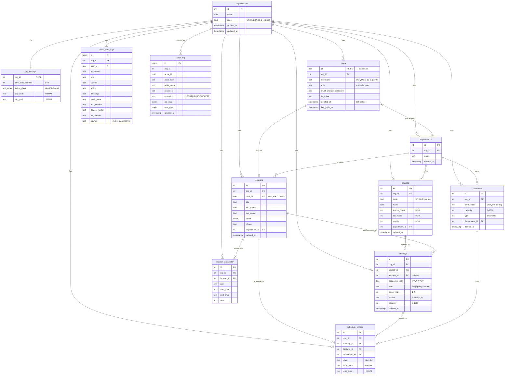
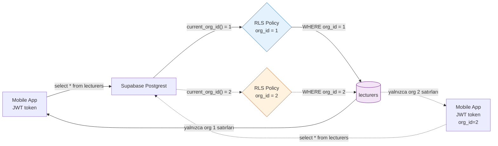
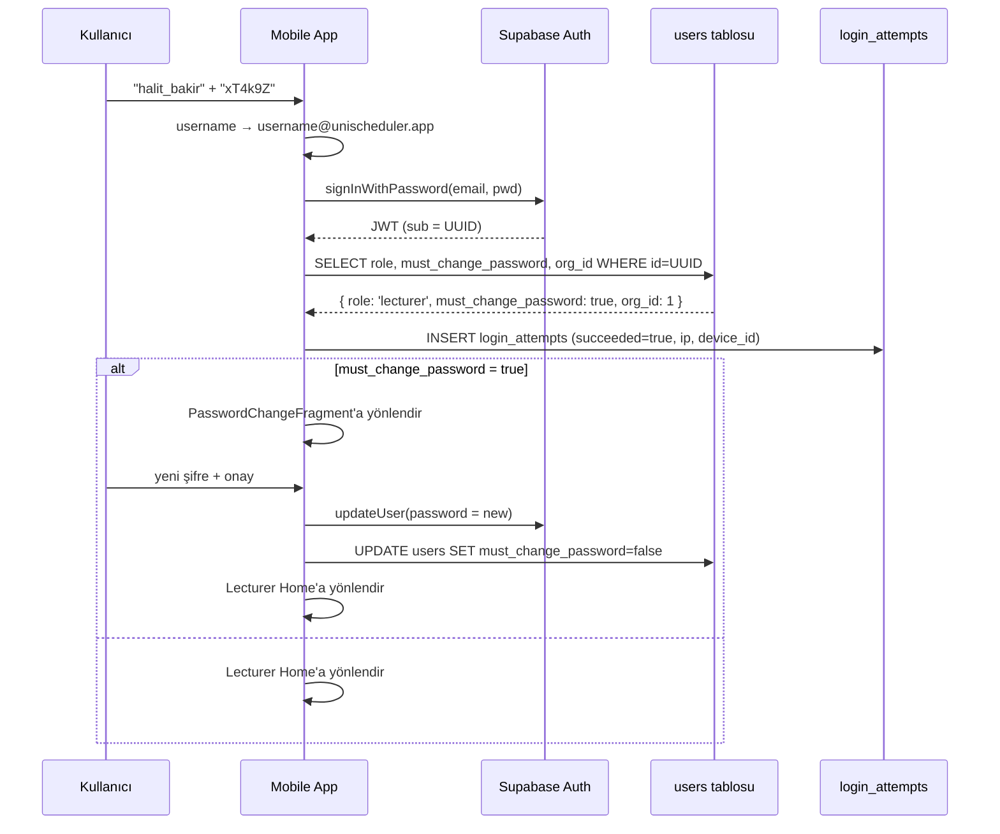
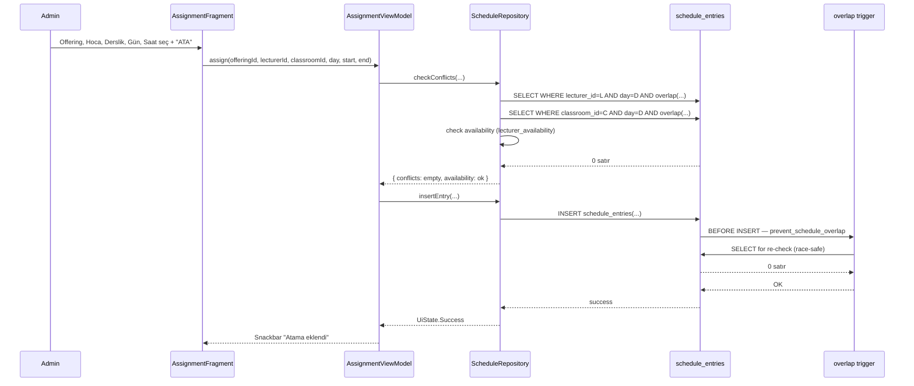
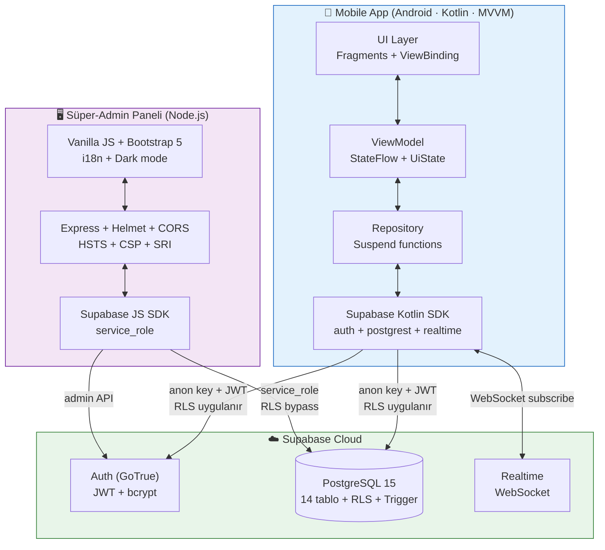

# UniScheduler — Veritabanı ER Diyagramı

Aşağıdaki diyagram `supabase/schema.sql`'deki 14 tablonun gerçek
ilişkisini gösterir. GitHub Markdown'ı Mermaid'i otomatik render eder.

## Tam Şema



## Çok-Kiracılı İzolasyon (org_id = Tenant Key)



`current_org_id()` SECURITY DEFINER fonksiyonu her isteğe JWT'nin
`sub` claim'inden bağlı kullanıcının `org_id`'sini döner. Her tablonun
SELECT/INSERT/UPDATE/DELETE policy'leri bu değere göre satırları filtreler.

## Çakışma Engeli (Race-Condition Korumalı)

```mermaid
sequenceDiagram
    participant A1 as Admin A
    participant A2 as Admin B
    participant DB as PostgreSQL
    participant T as prevent_schedule_overlap<br/>(BEFORE INSERT trigger)

    A1->>DB: BEGIN; INSERT schedule_entries<br/>(L=42, R=15, Pzt 10:00-12:00)
    A2->>DB: BEGIN; INSERT schedule_entries<br/>(L=42, R=15, Pzt 10:00-12:00)

    DB->>T: trigger fires (TX_A)
    T->>DB: SELECT FROM schedule_entries<br/>WHERE org_id=1 AND day='Mon' ...
    DB-->>T: 0 satır (henüz yok)
    T->>DB: OK
    DB->>A1: INSERT başarılı, COMMIT

    DB->>T: trigger fires (TX_B)
    T->>DB: SELECT FROM schedule_entries WHERE ...
    DB-->>T: 1 satır (Admin A'nın commit'i)
    T->>DB: RAISE EXCEPTION 'Schedule conflict'
    DB->>A2: ❌ check_violation, ROLLBACK
```

İki admin aynı anda atama yapsa bile, trigger transaction içinde son
durumu okur ve ikinci insert'i reddeder. TOCTOU yarış koşulu kapalı.
```

## Login + Şifre Değiştirme Akışı



## Atama Akışı (Çakışma Kontrolü Dahil)



## Bileşen Mimarisi



## Klasör Yapısı

```
UniScheduler/
├── app/                        ← Android mobile app
│   ├── src/main/java/com/unischeduler/
│   │   ├── data/
│   │   │   ├── model/          ← @Serializable data class'lar
│   │   │   ├── remote/         ← SupabaseClient
│   │   │   └── repository/     ← 10 repository
│   │   ├── notif/              ← AlarmManager, BootReceiver, ReminderScheduler
│   │   ├── scheduler/          ← Otomatik program algoritması
│   │   ├── ui/
│   │   │   ├── admin/          ← 5 Fragment + 5 ViewModel
│   │   │   ├── auth/           ← Login, PasswordChange
│   │   │   ├── lecturer/       ← Home, Calendar, Availability
│   │   │   └── shared/         ← WeeklyScheduleView, AvailabilityGridView
│   │   └── util/               ← Crash, ErrorReport, Excel, iCal, PDF, JSON
│   └── src/main/res/
│       ├── drawable/           ← Material vector icons
│       ├── layout/             ← 24 layout XML
│       ├── layout-sw600dp/     ← Tablet variant
│       ├── values/             ← strings (TR), themes, dimens, colors
│       ├── values-en/          ← strings (EN)
│       ├── values-night/       ← Dark theme colors
│       └── values-sw600dp/     ← Tablet dimens
│
├── super-admin-paneli/         ← Web panel (Node.js)
│   ├── public/
│   │   ├── css/style.css       ← CSS variables + dark theme
│   │   ├── js/
│   │   │   ├── app.js          ← Ana panel logic
│   │   │   ├── i18n.js         ← Çok dilli runtime
│   │   │   ├── theme.js        ← Light/dark/system
│   │   │   └── geo.js          ← IP → ülke lookup
│   │   ├── i18n/{tr,en}.json   ← 200+ key tam parite
│   │   └── index.html          ← data-i18n + SRI hash
│   └── server.js               ← Express + CTI + Alerting webhook
│
├── supabase/                   ← Database
│   ├── schema.sql              ← Tek-dosya kurulum
│   ├── migrations/             ← dbmate versioned migrations
│   └── README.md               ← Production deploy runbook
│
├── .github/                    ← CI/CD
│   ├── workflows/
│   │   ├── android-build.yml   ← Push'ta APK + test
│   │   ├── panel-check.yml     ← Panel syntax + i18n parite
│   │   └── release.yml         ← Tag'de otomatik GitHub Release
│   ├── dependabot.yml          ← Haftalık dep güncelleme
│   └── ISSUE_TEMPLATE/         ← Bug + feature template'leri
│
├── docs/
│   ├── diagrams/               ← Bu dosya
│   └── screenshots/
│
└── README.md
```
